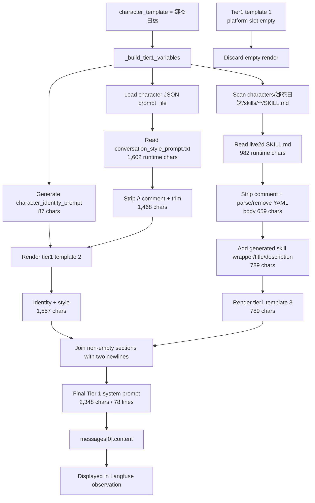
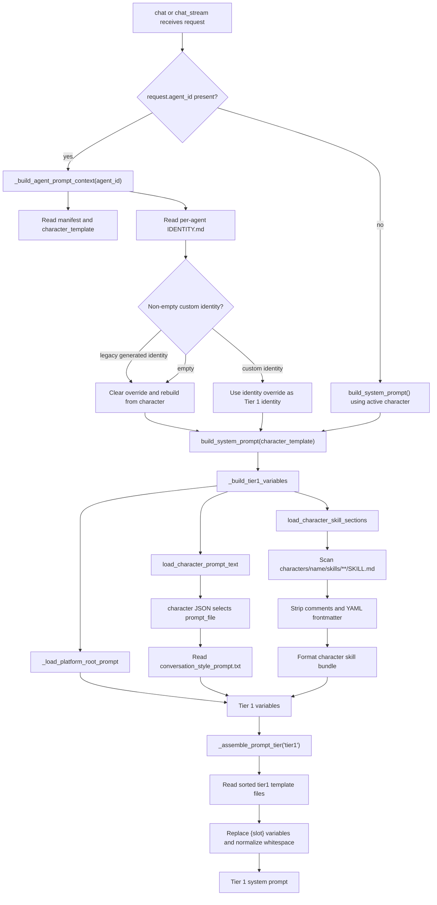
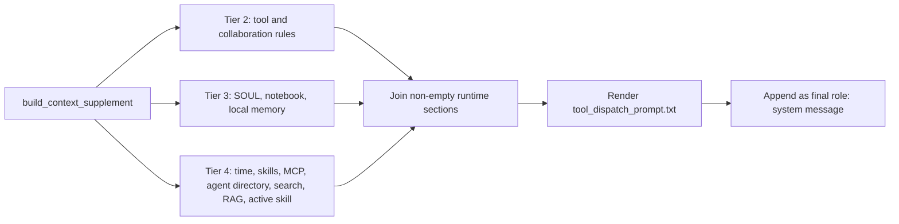
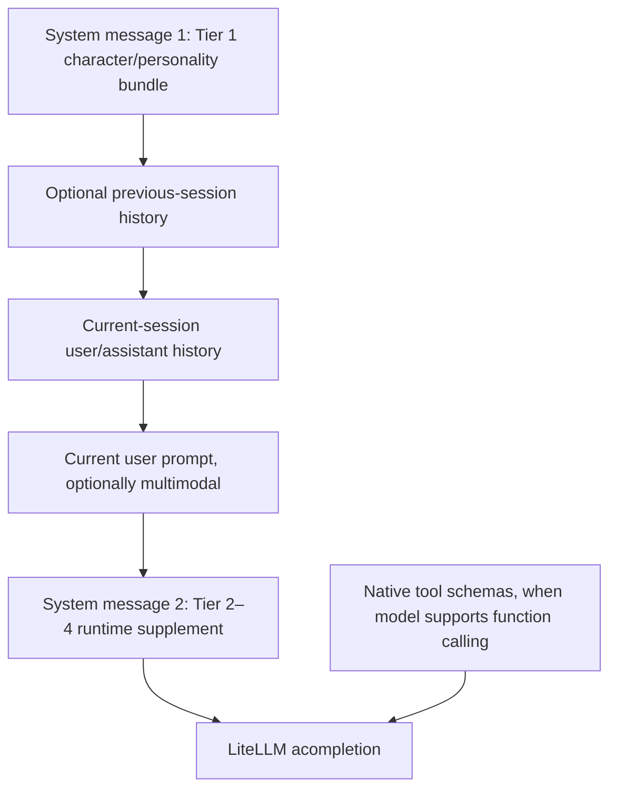

# NagaAgent System Prompt Assembly and Runtime Injection Analysis

## Analysis identity

| Field | Value |
|---|---|
| Analyzed repository | `F:\Programme\Agent\NagaAgent-main` |
| Analysis subject | How NagaAgent constructs, injects, sends, and observes its system prompts |
| Primary workflow | `POST /chat/stream` with the NagaCore engine and the `娜杰日达` character template |
| Secondary workflows | Non-stream chat, global active-character mode, per-agent identity overrides, prompt editing, context compression, and Langfuse observation |
| Architecture | Python/FastAPI application with file-backed prompt templates, runtime context assembly, LiteLLM provider calls, and optional agentic tool iterations |
| Source state | Local working snapshot inspected on 2026-08-04; conclusions are source- and local-execution-backed, not a claim about an unidentified deployed revision |
| Generated artifact | This Markdown report only; production source was not modified |

## 1. Exact reconstruction of the system prompt shown in Langfuse

The supplied Langfuse prompt is the output of the Tier 1 call:

```python
build_system_prompt("娜杰日达")
```

For this repository snapshot, its exact construction is:

```text
final_system_prompt
  = render(system/prompts/tier1/2_角色人格引用槽.md)
  + "\n\n"
  + render(system/prompts/tier1/3_角色内置能力引用槽.md)

  = (
      generated character_identity_prompt       # 87 characters
      + "\n\n"
      + processed conversation_style_prompt     # 1,468 characters
    )                                            # = 1,557 characters
    + "\n\n"                                   # 2 characters
    + formatted live2d_controller skill bundle  # 789 characters

  = 2,348 characters, 78 lines
```

The first Tier 1 template, `1_平台根提示词.md`, renders to an empty string in this snapshot and is discarded. Therefore it contributes nothing to the Langfuse text.

### 1.1 Visible prompt blocks and their exact producers

The displayed prompt can be divided into three visible blocks. Each block comes from a different assembly stage.

| Visible block in Langfuse | Exact producer | Source material | Transformation | Final contribution |
|---|---|---|---|---:|
| `人格模板：娜杰日达` and the two following template-origin sentences | `_build_tier1_variables()` | No text file; generated in Python | Interpolate `character_template` into a fixed string | 87 characters |
| `你是"娜杰日达"...` through the four `回复硬性要求` | `load_character_prompt_text()` | `characters/娜杰日达/conversation_style_prompt.txt` | Read UTF-8, remove `//` source-comment lines, trim, enforce 12,000-character limit | 1,468 characters |
| `角色自带技能` through the final Live2D `normal` selection rule | `load_character_skill_sections()` + `_format_character_skill_bundle()` | `characters/娜杰日达/skills/live2d_controller/SKILL.md` | Remove source comment, parse/remove YAML frontmatter, extract name/description, normalize body, add generated wrapper headings | 789 characters |

Nothing else supplies text to this particular 2,348-character Tier 1 result. In particular:

- `platform_root_prompt` is empty;
- `character_builtin_capabilities_prompt` is empty;
- `SOUL.md`, memory, public skills, MCP descriptions, RAG, time, and tool schemas are not part of this specific string;
- those dynamic inputs are assembled later into a separate system supplement or passed as tool schemas.

### 1.2 Stage A — choose the character source

The route obtains a character template in one of two ways:

```text
request has agent_id
  -> read that agent's manifest
  -> use record["character_template"]

request has no agent_id
  -> use config.system.active_character
  -> default is "娜杰日达"
```

For the normal `娜杰日达` path, `build_system_prompt()` calls:

```python
tier1_variables = _build_tier1_variables("娜杰日达", identity_override="")
```

The empty identity override is important. A non-empty custom `IDENTITY.md` would cause `_build_tier1_variables()` to return early and would prevent the normal personality file and Live2D character skill from entering this Tier 1 prompt. Because the supplied Langfuse text contains both, it matches the normal character-template branch rather than the custom-identity branch.

### 1.3 Stage B — construct the five Tier 1 variables

`_build_tier1_variables()` begins with five slots:

```python
variables = {
    "platform_root_prompt": "",
    "character_identity_prompt": "",
    "character_conversation_style_prompt": "",
    "character_builtin_skills_prompt": "",
    "character_builtin_capabilities_prompt": "",
}
```

After processing `娜杰日达`, their measured values are:

| Variable | How it is populated | Measured length | Appears in supplied prompt? |
|---|---|---:|---|
| `platform_root_prompt` | Attempts to read `system/prompts/platform_root_prompt.txt` | 0 | No |
| `character_identity_prompt` | Generated by Python from the character name | 87 | Yes, first block |
| `character_conversation_style_prompt` | Processed character prompt file | 1,468 | Yes, main personality block |
| `character_builtin_skills_prompt` | Formatted parsed character skills | 789 | Yes, Live2D block |
| `character_builtin_capabilities_prompt` | Initialized but no producer currently assigns content | 0 | No |

These variables are not appended directly. They are first inserted into ordered Tier 1 template files.

### 1.4 Stage C — transform `conversation_style_prompt.txt`

The character JSON contains:

```json
"prompt_file": "conversation_style_prompt.txt"
```

That selects:

```text
characters/娜杰日达/conversation_style_prompt.txt
```

The runtime transformation is:

```text
file as read by Python with normalized LF newlines       1,602 characters
  -> remove the leading `// 读取：...` source-comment line
  -> trim outer whitespace
processed character prompt                              1,468 characters
```

The runtime does not rewrite the personality prose. After comment removal and trimming, the following sections are preserved in their existing order:

1. `你是"娜杰日达"...` identity statement;
2. `表层性格`;
3. `深层性格`;
4. `语言表达风格`;
5. `与创造者柏斯阔落的关系`;
6. `回复硬性要求`.

The file's Markdown headings remain in the assembled string. Langfuse or the browser can visually render `##` as headings, and copying rendered text may omit the literal heading markers. That display behavior does not mean NagaAgent stripped those headings.

### 1.5 Stage D — transform `live2d_controller/SKILL.md`

The skill file transformation is more involved because the raw file contains both metadata and instructions:

```text
SKILL.md as read by Python with normalized LF newlines    982 characters
  -> remove leading `// 读取：...` source-comment line
  -> trim outer whitespace
comment-filtered skill text                               849 characters
  -> parse YAML frontmatter
       name        = "live2d_controller"
       description = 57 characters
  -> remove YAML frontmatter from visible body
  -> remove one leading Markdown heading if present
visible instruction body                                  659 characters
  -> add generated role-skill wrapper, title, description,
     and required blank-line separators
formatted character skill bundle                          789 characters
```

The final 789-character block is conceptually constructed as:

```text
## 角色自带技能

以下技能属于该角色模板的一部分，会随角色一同注入，不作为可选公共技能。

### live2d_controller

<description taken from YAML frontmatter>

<659-character SKILL.md instruction body>
```

This explains why the Langfuse prompt contains the skill name and description even though the YAML frontmatter itself is not visible. The assembler removes the YAML syntax, extracts two of its values, and re-emits those values as ordinary prompt text.

The Markdown backticks around action names and the JSON code fence remain in the assembled string. A rendered/copy-pasted Langfuse view may present them as formatted text rather than preserving the literal backtick characters.

### 1.6 Stage E — render the three Tier 1 templates

`_assemble_prompt_tier("tier1", variables)` sorts the files by filename and renders them one by one.

| Order | Template | Template after `//` comment removal | Slot result | Rendered length | Kept? |
|---:|---|---:|---|---:|---|
| 1 | `1_平台根提示词.md` | `{platform_root_prompt}` | Empty | 0 | No |
| 2 | `2_角色人格引用槽.md` | Identity slot + blank line + personality slot | 87 + 2 + 1,468 | 1,557 | Yes |
| 3 | `3_角色内置能力引用槽.md` | Character-skill slot + blank line + capabilities slot | 789 + empty | 789 | Yes |

For each template, `_render_prompt_template()` performs three operations:

1. Replace every `{slot_name}` with the corresponding value or an empty string.
2. Remove trailing whitespace from every line.
3. Collapse three or more consecutive newlines to two, then trim the result.

The empty platform and capabilities slots therefore do not leave large blank regions.

### 1.7 Stage F — join the non-empty rendered sections

`_assemble_prompt_tier()` keeps only rendered strings whose final value is non-empty, then joins them with `"\n\n"`:

```python
sections = [
    rendered_character_identity_and_style,  # 1,557
    rendered_character_skill_bundle,        #   789
]

final_system_prompt = "\n\n".join(sections)
```

The arithmetic is exact:

```text
1,557 + 2 + 789 = 2,348 characters
```

That final string is what `build_system_prompt()` returns. The route passes it to `message_manager.build_conversation_messages()`, which stores it as:

```python
{"role": "system", "content": system_prompt}
```

### 1.8 Exact assembly graph for the displayed text



### 1.9 What the displayed prompt does not show

The exact pasted text ends at the Live2D selection rules, so it corresponds to the Tier 1 character bundle. The full LLM request can still be larger. After constructing conversation history and the current user message, the route separately calls `build_context_supplement()` and appends another system message containing Tier 2–4 runtime material such as time, tool rules, `SOUL.md`, memory, skill metadata, MCP services, agent directory, and RAG results.

Therefore these two questions have different answers:

| Question | Answer |
|---|---|
| How is the exact Naga system prompt pasted from Langfuse assembled? | 87-character generated header + 1,468-character processed personality file + 789-character formatted Live2D skill, arranged through two non-empty Tier 1 templates. |
| How is the complete model request assembled? | Tier 1 prompt + history + current user message + separate Tier 2–4 system supplement + optional native tool schemas. |

### 1.10 Measurements and function profile

| Measurement | Result |
|---|---:|
| Final characters | 2,348 |
| Final lines | 78 |
| Tier 1 template 1 output | 0 characters; discarded |
| Tier 1 template 2 output | 1,557 characters |
| Tier 1 template 3 output | 789 characters |
| Join separator between kept templates | 2 characters |
| SHA-256 of assembled UTF-8 text | `EC45D10AD69A13764105284D38ADA0514B1E102C6D34E4AA9C1966285481BF8E` |

Dynamic profiling found **16 named NagaAgent functions** in this Tier 1 build when file loading, comment filtering, skill parsing, and slot rendering are counted. Four functions provide the main assembly structure:

- `build_system_prompt()`
- `_build_tier1_variables()`
- `_format_character_skill_bundle()`
- `_assemble_prompt_tier()`

Langfuse appears only after this construction. Its adapter accepts an already-assembled `messages` object and records a compacted observation input; it does not participate in producing the 2,348-character string.

## 2. Scope and evidence boundary

### Included

- Character selection and prompt-manager initialization.
- Per-agent `IDENTITY.md` override handling.
- Character JSON metadata lookup.
- Character personality file loading.
- Character-owned skill discovery and frontmatter parsing.
- Tier 1 template rendering.
- Conversation message ordering.
- Tier 2, Tier 3, and Tier 4 runtime supplement construction.
- Public/private skill metadata and selected-skill instruction injection.
- MCP/tool-schema branches.
- Agentic-loop reuse of the constructed messages.
- Context compression changes to the first system message.
- LiteLLM request handoff.
- Langfuse adapter direction and repository call-site status.
- Comparison with the supplied short “Safe Mode” prompt.

### Not proven by this report

- Which deployed NagaAgent commit produced a particular Langfuse trace.
- Which external gateway, LiteLLM callback, or observability configuration uploaded that trace.
- Exact provider-side prompt normalization.
- Exact model token count: character count is measured, but tokenization depends on the chosen model/tokenizer.
- Exact Tier 2–4 length for every turn, because skills, MCP services, time, memory, RAG, and selected agent differ at runtime.

### Evidence strength

The Tier 1 structure is supported by both source inspection and a local function execution. Runtime routing and Tier 2–4 composition are supported by connected source paths. The behavior of an unidentified production deployment remains conditional on its revision and configuration.

## 3. High-level architecture

NagaAgent divides prompt material across three storage domains and several logical tiers.

| Storage domain | Purpose | Typical files | Prompt tier |
|---|---|---|---|
| `system/prompts` | Platform rules, tool rules, tier slot templates, dispatch wrapper, compression prompt | `tier1/*`, `tier2/*`, `tier3/*`, `tier4/*`, `tool_dispatch_prompt.txt` | Tier 1–4 templates |
| `characters/<name>` | Character's innate identity, expression style, and character-owned capabilities | `conversation_style_prompt.txt`, `skills/*/SKILL.md`, character JSON | Tier 1 content |
| Per-agent data under the configured data directory | Individual agent's acquired identity, preferences, notes, and memory | `IDENTITY.md`, `SOUL.md`, `notes/CLAUDE.md`, `memory/*` | Tier 1 override and Tier 3 content |
| Conversation/session storage | User/assistant/tool history and compacted state | Session messages | Message layer |

The code comments and prompt README describe five logical layers, but the runtime API sends them as an ordered message list rather than one permanently concatenated master string.

## 4. Tier 1 assembly workflow

### 4.1 Workflow graph



### 4.2 Entry from the chat route

For a request with `agent_id`, `_build_agent_prompt_context()` resolves an agent manifest, verifies that its engine belongs to the NagaCore family, and locates the agent's instance directory. It then reads:

- `IDENTITY.md` up to 16,000 characters;
- `SOUL.md` up to 5,000 characters;
- `notes/CLAUDE.md` up to 4,000 characters;
- at most three recent memory text/Markdown files, each up to 1,200 characters;
- project, public, and private skills;
- MCP services visible to that agent.

Only `IDENTITY.md` can replace the Tier 1 character identity. `SOUL.md`, notes, and memory are held for Tier 3.

For a request without `agent_id`, the route calls `build_system_prompt()` directly. The default `SystemConfig.active_character` is `娜杰日达` when configuration does not override it.

### 4.3 Identity override decision

The agent path reads `IDENTITY.md` and compares it to the old generated character identity format:

- If it is exactly the legacy generated value, the code clears it and rebuilds from the current character template. This allows character-template updates to take effect instead of freezing an old generated copy.
- If it is a non-empty custom identity, `_build_tier1_variables()` assigns it to `character_identity_prompt` and returns immediately.
- If it is empty, normal character assembly continues.

The early return has an important consequence: a custom `IDENTITY.md` override currently bypasses loading the character conversation-style file and the character-owned skill bundle. Therefore a truly custom identity can also remove the built-in Live2D instructions unless those instructions are copied into the override or injected elsewhere.

### 4.4 Character metadata selects the prompt file

`load_character_prompt_text()` first calls `load_character(character_template)`. For `娜杰日达`, the JSON metadata declares:

```json
{
  "prompt_file": "conversation_style_prompt.txt",
  "live2d_model": "NagaTest2/NagaTest2.model3.json",
  "portrait": "Naga.png",
  "voice": "Nadezhda"
}
```

Only `prompt_file` affects the text assembly shown here. Image, model, portrait, and voice bindings are character assets, not prompt text.

If `prompt_file` is absent from the JSON, the loader defaults to `conversation_style_prompt.txt`.

### 4.5 Personality file processing

The selected prompt file is read as UTF-8 by `character_bundle._read_text()` and processed as follows:

1. Remove whole lines beginning with `//` outside fenced code blocks.
2. Trim outer whitespace.
3. Return the full text if it is at or below 12,000 characters.
4. Otherwise truncate and append `[已截断]`.

The decoded file contains 1,631 code units when CRLF line endings are preserved by a raw filesystem reader. Python's `Path.read_text()` applies universal-newline translation, so the runtime sees 1,602 characters before filtering. After the prompt comment is removed and outer whitespace is trimmed, its Tier 1 contribution is 1,468 characters.

This file supplies the following sections from the Langfuse prompt:

- identity statement beginning with `你是"娜杰日达"`;
- surface personality;
- deep personality;
- language-expression style;
- relationship with the creator;
- hard response requirements.

### 4.6 Character-owned skill processing

`load_character_skill_sections()` recursively scans:

```text
characters/<character_template>/skills/**/SKILL.md
```

Each skill file is processed independently:

1. Read as UTF-8 and remove `//` comment lines.
2. Truncate at 8,000 characters per skill if needed.
3. Parse YAML frontmatter.
4. Use frontmatter `name`, or the directory name, as the displayed skill title.
5. Read `description` from frontmatter.
6. Remove the frontmatter from the body.
7. Remove one leading Markdown heading from the body to avoid duplicate headings.
8. Return `{title, description, content}`.

`_format_character_skill_bundle()` then creates:

```text
## 角色自带技能

以下技能属于该角色模板的一部分，会随角色一同注入，不作为可选公共技能。

### <skill name>

<description>

<processed skill body>
```

In this snapshot, `娜杰日达` owns one character skill: `live2d_controller`. Its processed contribution is 789 characters.

Character-owned skills are intentionally different from public/selectable skills:

- Character-owned skills are loaded in full into Tier 1 every time that character template is assembled.
- Public/private skills contribute metadata to Tier 4 by default; their full instructions are loaded only when a user activates a skill.

### 4.7 Generated identity header

When a character template is active and there is no custom identity override, `_build_tier1_variables()` generates the header:

```text
# 人格模板：娜杰日达

以下内容从 characters 模板初始化，用作该干员的人格基底。
后续个性化发展请写入 SOUL.md、记忆和记事本等实例文件，不要改回模板源。
```

This header is code-generated, not stored in the character text file. Its contribution for `娜杰日达` is 87 characters.

### 4.8 Tier 1 slot templates

`_assemble_prompt_tier("tier1", variables)` lists all files directly inside `system/prompts/tier1`, sorts them by filename, reads each one, substitutes `{slot_name}` placeholders, removes empty results, and joins the remaining sections with two newlines.

The current order is:

| Order | Template | Slot contribution |
|---:|---|---|
| 1 | `1_平台根提示词.md` | `platform_root_prompt` |
| 2 | `2_角色人格引用槽.md` | `character_identity_prompt` + `character_conversation_style_prompt` |
| 3 | `3_角色内置能力引用槽.md` | `character_builtin_skills_prompt` + `character_builtin_capabilities_prompt` |

Two current slots are empty in this snapshot:

- `platform_root_prompt` is empty because `system/prompts/platform_root_prompt.txt` is absent.
- `character_builtin_capabilities_prompt` is initialized but has no current producer.

The effective Tier 1 formula is therefore:

```text
generated character header

+ processed conversation_style_prompt.txt

+ processed and formatted character SKILL.md files
```

## 5. Exact function count

The phrase “how many functions assemble it?” depends on the counting level.

### 5.1 Four high-level assembly functions

| Function | Responsibility |
|---|---|
| `build_system_prompt()` | Select character, request Tier 1 variables, assemble Tier 1, and provide fallback |
| `_build_tier1_variables()` | Resolve platform, identity, character text, and character-skill variable values |
| `_format_character_skill_bundle()` | Convert parsed character skill records into prompt text |
| `_assemble_prompt_tier()` | Read ordered templates, render slots, and join sections |

### 5.2 Sixteen named functions in the measured core call tree

Dynamic profiling of `build_system_prompt("娜杰日达")` observed these named NagaAgent functions:

| # | Function | Calls | Role |
|---:|---|---:|---|
| 1 | `build_system_prompt` | 1 | Public Tier 1 builder |
| 2 | `_build_tier1_variables` | 1 | Variable orchestration |
| 3 | `_load_platform_root_prompt` | 1 | Optional platform-root source |
| 4 | `_read_prompt_text_file` | 4 | Attempt platform-root read and read three Tier 1 templates |
| 5 | `load_character_prompt_text` | 1 | Resolve/read character personality file |
| 6 | `load_character` | 1 | Read character JSON metadata |
| 7 | `_read_text` | 2 | Read character prompt and one skill file |
| 8 | `strip_prompt_comment_lines` | 5 | Filter prompt-source comments |
| 9 | `load_character_skill_sections` | 1 | Parse all character skills |
| 10 | `_iter_character_skill_files` | 1 | Find `SKILL.md` files |
| 11 | `_parse_frontmatter` | 1 | Parse the Live2D YAML metadata |
| 12 | `strip_frontmatter` | 1 | Remove YAML from skill body |
| 13 | `_strip_leading_heading` | 1 | Avoid duplicate skill headings |
| 14 | `_format_character_skill_bundle` | 1 | Build character-skill prompt block |
| 15 | `_assemble_prompt_tier` | 1 | Sort and join Tier 1 templates |
| 16 | `_render_prompt_template` | 3 | Substitute slots in each Tier 1 file |

The profiler also saw module execution, generator expressions, and a substitution lambda. They are implementation mechanics rather than named architectural functions, so they are excluded from the reported count of 16.

## 6. Tier 2–4 runtime supplement

Tier 1 is deliberately described in the route as “纯人格” — pure personality. Dynamic knowledge is constructed separately by `build_context_supplement()`.

### 6.1 Supplement assembly graph



### 6.2 Tier 2 — stable tool and collaboration rules

Tier 2 is assembled from four ordered files:

| File | Contribution |
|---|---|
| `1_工具调度总则.md` | Optional text-tool contract from `agentic_tool_prompt.txt` |
| `2_直接工具与MCP.md` | Distinguishes direct tools from MCP and prioritizes direct execution |
| `3_多干员协作规则.md` | Defines agent-directory lookup and `agent_relay` behavior |
| `4_openclaw临时执行器边界.md` | Separates local tools, OpenClaw-backed agents, and local sessions |

The first file can be empty. When the model supports native function calling, `include_tool_instructions=False`, so the textual `agentic_tool_prompt.txt` contract is not injected. The remaining static Tier 2 rules still render.

### 6.3 Tier 3 — per-agent acquired identity and memory

`build_instance_prompt_section()` renders three ordered templates:

| Input | Source | Maximum read by chat context builder |
|---|---|---:|
| `agent_soul_prompt` | Per-agent `SOUL.md` | 5,000 characters |
| `agent_notebook_prompt` | Per-agent `notes/CLAUDE.md` | 4,000 characters |
| `agent_long_term_memory_prompt` | Up to three recent `memory/*.md|*.txt` files | 1,200 per file |

This distinction is intentional:

- `characters/` defines innate character behavior shared by agents using that template.
- Per-agent files define acquired preferences, development, notes, and memory unique to one agent instance.

Empty slots render away, so a non-agent request can have little or no Tier 3 text.

### 6.4 Tier 4 — turn-specific runtime context

Tier 4 can include:

| Ordered section | Source or producer | Stability |
|---|---|---|
| Time and environment | `datetime.now()` plus optional environment snapshot | Changes by turn |
| Skill directory | `SkillManager.generate_skills_prompt()` or agent-specific override | Changes with installed/enabled skills |
| MCP directory | `get_mcp_manager().format_available_services*()` | Changes with services and agent permissions |
| Current identity and agent directory | `_build_multi_agent_context_section()` | Changes with active agent/directory |
| Pre-search results | Route-provided `search_section` | Conditional |
| RAG memory | Remote memory query result | Conditional and turn-specific |
| Activated skill instructions | Full selected skill body | Conditional on `request.skill` |

When no explicit skill is selected, the supplement includes skill metadata, not every public skill's full body. When a skill is selected, the metadata list is omitted and that skill's complete instructions are injected with a highest-priority label.

### 6.5 Dispatch wrapper

After Tier 2, Tier 3, and Tier 4 are joined, `build_context_supplement()` inserts them into `tool_dispatch_prompt.txt`:

```text
━━━━━━━━━━ 以下是附加知识 ━━━━━━━━━━
{runtime_context_sections}
【读完这些附加知识后，回复上一个user prompt，并不要回复这条系统附加的system prompt。以下是回复内容：】
```

The final sentence explicitly tells the model that this late system message is context for answering the preceding user prompt, not content that should itself be answered.

## 7. Final message ordering

### 7.1 Message construction

`message_manager.build_conversation_messages()` produces the initial list in this order:

```text
messages[0] = Tier 1 system prompt
optional previous-session messages
current-session history
current user message
```

The chat route then appends the runtime supplement:

```text
messages[-1] = Tier 2–4 system supplement
```

For streaming requests with images, the route walks backward to find the most recent user message and converts only that message into multimodal content, leaving the trailing system supplement in place.

### 7.2 Model-visible stack



The order is unusual compared with systems that send one system prompt only at the beginning. Here, the stable personality remains first while dynamic context is deliberately placed at the end to keep it close to the current user prompt and model attention.

Provider adapters may normalize multiple system messages differently, so a raw provider payload capture is required to prove the exact wire representation for each model family. The local `messages` list order is nevertheless explicit.

## 8. Streaming agentic-loop workflow

### 8.1 End-to-end sequence

```mermaid
sequenceDiagram
    actor User
    participant Route as POST /chat/stream
    participant AgentCtx as _build_agent_prompt_context
    participant Tier1 as build_system_prompt
    participant Msg as MessageManager
    participant Memory as Remote memory/RAG
    participant Supplement as build_context_supplement
    participant Tools as Tool schema registry
    participant Loop as run_agentic_loop
    participant LLM as LLMService/LiteLLM
    participant Executor as Tool executor
    participant UI as SSE client

    User->>Route: message + optional agent_id/skill/images
    Route->>AgentCtx: resolve per-agent prompt context
    AgentCtx->>Tier1: build character or identity-override prompt
    Tier1-->>Route: stable Tier 1 text
    Route->>Msg: build conversation messages
    Msg-->>Route: system + history + current user
    Route->>Memory: query relevant memory
    Memory-->>Route: RAG section or empty
    Route->>Supplement: Tier 2–4 variables
    Supplement-->>Route: runtime system supplement
    Route->>Route: append supplement as system message
    alt native function calling supported
        Route->>Tools: get_all_tool_schemas(agent_id)
        Tools-->>Route: permitted tool schemas
    end
    Route->>Loop: messages + tools + session

    loop up to max agentic rounds
        Loop->>Loop: compress context if threshold exceeded
        Loop->>LLM: stream_chat_with_context(messages, tools)
        LLM-->>Loop: reasoning/content/tool-call deltas
        Loop-->>UI: SSE content and status events
        alt actionable tools requested
            Loop->>Executor: execute calls
            Executor-->>Loop: tool results
            Loop->>Loop: append assistant call + tool results
        else no actionable tool request
            Loop-->>Route: finish
        end
    end
```

### 8.2 Provider call

`LLMService.stream_chat_with_context()` creates a LiteLLM parameter dictionary containing:

- normalized model name;
- the already-assembled `messages` list;
- normalized temperature;
- configured maximum output tokens;
- `stream=True`;
- timeouts and retry settings;
- provider API credentials/base URL;
- optional native tool schemas;
- optional `parallel_tool_calls=True` for non-Anthropic API formats.

The provider request is therefore downstream of every prompt-assembly step described above.

### 8.3 Reuse across tool rounds

`run_agentic_loop()` receives the complete messages list once. Before every model round it can compress context. It then calls `stream_chat_with_context()` with the current messages. If tools are requested, assistant tool-call messages and tool results are appended before the next round.

Tier 1 is not rebuilt between tool rounds. It remains at the beginning of the mutable message list unless context compression replaces its content with a summarized variant.

## 9. Context compression and system-prompt mutation

Before every agentic-loop round, `compress_context(messages)` counts tokens. If the list exceeds the configured threshold, it:

1. preserves `messages[0]` when it is a system message;
2. partitions the remaining messages into user-centered loops;
3. retains a bounded recent tail;
4. summarizes older loops with another LLM call;
5. appends or replaces a `<compress>` block inside the first system message;
6. returns the new first system message plus recent loops.

This means the Tier 1 prompt can grow to include:

```xml
<compress>
...summary of older conversation...
</compress>
```

The initial character bundle is stable at construction time, but the first system message is not immutable for the whole session. Compression can add a summary to it later.

The trailing Tier 2–4 supplement belongs to the loop grouping after index 0. Whether it survives a particular compression depends on which recent loops are retained. Since system messages after a user message are grouped with that user-centered loop, the current turn's supplement is normally part of the most recent loop.

## 10. Langfuse boundary

### 10.1 Direction of data flow

The repository's Langfuse integration is an observability adapter. Its stated rules are:

- chat/tool behavior must not depend on Langfuse availability;
- observability failures must not change runtime behavior;
- large prompt/output payloads are compacted before leaving the process.

`start_llm_generation_observation()` accepts `messages` as an argument and records:

```python
input=compact_langfuse_payload(messages)
```

The direction is therefore:

```text
local files + runtime state
    → NagaAgent prompt assembly
    → model messages
    → Langfuse observation input
```

It is not:

```text
Langfuse prompt
    → NagaAgent downloads prompt
    → model
```

### 10.2 No Langfuse prompt retrieval

The inspected module initializes a Langfuse client, starts observations, propagates session attributes, records inputs/outputs/usage, flushes, and shuts down. It does not call a Langfuse prompt-management API such as `get_prompt`, `getPrompt`, or a prompt compile/fetch operation.

### 10.3 Production call-site limitation

A repository-wide search in this snapshot found:

- Langfuse adapter definitions;
- unit tests that call the adapter helpers;
- no production import or call site for `start_llm_generation_observation()` or the tool-observation helpers.

Therefore the Langfuse record observed by the user may come from:

- an external LiteLLM callback;
- the Naga model gateway;
- deployment-only instrumentation;
- a different source revision.

The exact uploader is unknown from this snapshot. This does not change the prompt-origin conclusion: the long Naga text matches the local Tier 1 assembly sources and is not defined in the Langfuse adapter.

### 10.4 Langfuse compaction

The local adapter's generic payload compactor defaults to a 4,000-character maximum per string. The measured 2,348-character Tier 1 prompt fits below that individual-string ceiling. Larger supplement, history, or result strings may be truncated in an observation even when the full content was sent to the provider.

Consequently, Langfuse display content should not automatically be treated as the exact raw wire payload unless the instrumentation and compaction settings are known.

## 11. Comparison with the short Safe Mode prompt

The supplied short prompt contains:

- a generic safety policy;
- a generic tool-use policy;
- no character personality;
- no creator relationship;
- no character-owned skill;
- no Live2D behavior.

A repository-wide exact-text search found no match for:

- `You are running in Safe Mode.`
- `When using tools: never return an empty response`
- `Do NOT generate pornographic`

Therefore that prompt is not generated from a visible source file in this NagaAgent snapshot. It belongs to another version, gateway, client, or execution mode.

The length difference is primarily a content-policy difference, not a difference in the number of helper functions:

| NagaAgent Tier 1 | Short Safe Mode prompt |
|---|---|
| Character-specific | Generic |
| Personality and relationship model | No personality |
| Detailed language style | Minimal style policy |
| Four hard response constraints | Safety rules |
| Full Live2D skill instructions | Generic tool rules |
| Assembled from multiple local sources | Appears to be one fixed string |

The supplied `context_count: 24` field is not defined by the visible NagaAgent prompt assembler. It likely describes conversation/context items in the other system, not “24 prompt assembly functions.” Its exact semantics require the source that produced that JSON.

## 12. Override, fallback, and failure branches

### 12.1 Normal character path

Condition:

- a character template is supplied or selected globally;
- no custom `IDENTITY.md` override is active;
- character metadata and prompt file can be read.

Result:

- generated identity header;
- character personality text;
- character-owned skills;
- ordered Tier 1 rendering.

### 12.2 Custom identity override

Condition:

- `IDENTITY.md` contains non-empty content that is not the legacy generated identity.

Result:

- that content becomes `character_identity_prompt`;
- `_build_tier1_variables()` returns early;
- character personality and built-in character skills are not loaded in this branch.

### 12.3 Legacy identity migration branch

Condition:

- `IDENTITY.md` exactly equals the old character-generated identity.

Result:

- the override is cleared in memory;
- current character sources are assembled again;
- new character-owned skills and template changes can appear.

### 12.4 Missing character prompt

If character loading fails or yields no prompt text, `_build_tier1_variables()` falls back to:

```python
get_prompt("conversation_style_prompt", ai_name=ai_name)
```

At API startup, `set_active_character()` points the `PromptManager` at the active character directory. Outside that initialized state, the global prompt manager defaults to `system/prompts`.

### 12.5 Missing Tier 1 templates

If `_assemble_prompt_tier("tier1", ...)` returns an empty string:

- a non-empty identity override is returned directly;
- otherwise the global `conversation_style_prompt` fallback is returned.

### 12.6 File-read failures

Character text helpers generally convert missing/read failures to empty strings. The route catches exceptions from Tier 1 assembly, logs a warning, and falls back to an identity override or a default `build_system_prompt()` call.

This makes the chat path resilient, but a partial prompt can be silently shorter than intended unless warnings are monitored.

## 13. Prompt editing and caching behavior

### 13.1 Character selection

At FastAPI lifespan startup, the server calls `set_active_character(active_character)`. This replaces the global `PromptManager` with one rooted in the active character directory.

Switching character through the control tool:

1. validates the character directory;
2. calls `set_active_character(character)`;
3. writes the new name to configuration.

### 13.2 Prompt API

`GET /system/prompt` calls `build_system_prompt()` and returns the assembled Tier 1 result.

`POST /system/prompt` calls:

```python
save_prompt("conversation_style_prompt", content)
```

When the active-character prompt manager has been initialized, this writes the character's `conversation_style_prompt.txt` and updates its in-memory cache.

### 13.3 Two different caching behaviors

- `PromptManager._load_prompt()` caches named prompt files and reloads them when file modification time changes.
- `character_bundle.load_character_prompt_text()` and `load_character_skill_sections()` read character sources directly on each Tier 1 build; they do not use `PromptManager` caching in the normal character path.

Thus the dominant normal character assembly performs filesystem reads and a recursive skill scan per prompt build. The current size is small, but the behavior matters if many character skills or high request concurrency are introduced.

### 13.4 API naming inconsistency

`GET /system/prompt` accepts `include_skills: bool = False`, but the parameter is not used. Its docstring says the default excludes the skill list, while `build_system_prompt()` always includes character-owned skills in Tier 1.

The likely intended distinction is:

- character-owned skills are part of the personality bundle;
- selectable public/private skill metadata is not part of the Tier 1 endpoint.

The current API name/docstring does not make that distinction explicit.

## 14. Size, cost, and maintainability implications

### 14.1 What makes this prompt long

The Live2D skill body accounts for 789 of 2,348 characters—about one third of the measured Tier 1 text. The personality file accounts for most of the remainder. The Python-generated/template overhead is small.

The complete request can be much larger than 2,348 characters because it may also contain:

- Tier 2 fixed rules;
- Tier 3 instance files;
- Tier 4 skill/MCP/directory/RAG data;
- conversation history;
- tool schemas;
- tool-call and tool-result messages;
- a compression summary.

### 14.2 Token count cannot be inferred exactly from characters

Chinese text, Latin identifiers, Markdown punctuation, and JSON tool schemas tokenize differently across model families. The report therefore records exact characters and lines rather than presenting a guessed token total as fact.

For cost analysis, count tokens using the exact provider model and the final post-adapter message payload.

### 14.3 Potential duplication

Tool-related behavior appears in several places:

- character-owned Live2D skill text in Tier 1;
- Tier 2 tool boundaries;
- Tier 4 MCP and skill metadata;
- optional textual agentic tool contract;
- native tool schemas.

Some duplication is deliberate: one layer explains character behavior while another enforces runtime protocol. However, overlapping instructions can increase prompt size and create conflicts if edited independently.

### 14.4 Practical shortening options

If prompt size becomes a problem, the least disruptive options are:

1. Keep only Live2D decision rules in Tier 1 and move schema/mechanical details into the native tool description.
2. Inject the full Live2D skill only for models or routes where the tool is available.
3. Cache the completed Tier 1 bundle by character plus source modification times.
4. Add a per-character manifest field controlling whether a skill is always injected, metadata-only, or loaded on demand.
5. Remove duplicated tool-format instructions when native function calling is enabled.
6. Capture final provider token counts before deciding that the Tier 1 text itself is the dominant cost.

These are design options, not changes performed by this analysis.

## 15. Corresponding source code

The excerpts below are minimal source evidence. `# ...` or `# omitted` inside an excerpt marks content omitted by this report; it is not claimed to be a literal source line.

### CE-01 — Chat route obtains Tier 1 and appends Tier 2–4

- File: `apiserver/routes/chat.py`
- Lines: 752–837
- Supports: stable personality first, dynamic supplement last.

```python
# 系统提示词 = 纯人格
system_prompt = agent_ctx.system_prompt if agent_ctx else build_system_prompt()

# 用户消息使用带技能前缀的版本
effective_message = user_message

# ...

# 先构建对话消息（人格在 messages[0]）
messages = message_manager.build_conversation_messages(
    session_id=session_id, system_prompt=system_prompt, current_message=effective_message
)

# ... RAG and function-calling detection omitted ...

supplement = build_context_supplement(
    include_skills=True,
    include_tool_instructions=not supports_fc,
    skill_name=request.skill,
    rag_section=rag_section,
    multi_agent_context_section=_build_multi_agent_context_section(agent_ctx),
    skills_prompt_override=agent_ctx.skills_prompt if agent_ctx else None,
    # ...
    agent_soul_prompt=agent_ctx.agent_soul_prompt if agent_ctx else "",
    agent_notebook_prompt=agent_ctx.agent_notebook_prompt if agent_ctx else "",
    agent_long_term_memory_prompt=(
        agent_ctx.agent_long_term_memory_prompt if agent_ctx else ""
    ),
)
messages.append({"role": "system", "content": supplement})
```

**Meaning:** the long character prompt and dynamic supplement are separate system messages.

### CE-02 — Per-agent identity and memory sources

- File: `apiserver/routes/chat.py`
- Lines: 326–378
- Supports: override, SOUL, notes, memory, skills, and MCP inputs.

```python
agent_dir = get_data_dir() / "agents" / agent_id
identity_path = agent_dir / "IDENTITY.md"
soul_path = agent_dir / "SOUL.md"
notes_path = agent_dir / "notes" / "CLAUDE.md"

identity_override = _read_text_snippet(identity_path, max_chars=16000)
if identity_override and record.get("character_template"):
    try:
        if is_legacy_character_identity(identity_override, record.get("character_template")):
            identity_override = ""
    # ... exception logging omitted ...

system_prompt = build_system_prompt(
    record.get("character_template"),
    identity_override=identity_override,
)

soul_text = _read_text_snippet(soul_path, max_chars=5000)
notes_text = _read_text_snippet(notes_path, max_chars=4000)
memory_section = _load_memory_section(agent_dir / "memory")
```

**Meaning:** per-agent identity can replace Tier 1, while acquired soul/notes/memory are retained for Tier 3.

### CE-03 — Tier 1 variable construction

- File: `system/config.py`
- Lines: 1088–1135
- Supports: generated header, character text, character skills, and override behavior.

```python
def _build_tier1_variables(
    character_template: Optional[str],
    *,
    identity_override: str = "",
) -> Dict[str, str]:
    ai_name = config.system.ai_name
    variables = {
        "platform_root_prompt": _load_platform_root_prompt(ai_name),
        "character_identity_prompt": "",
        "character_conversation_style_prompt": "",
        "character_builtin_skills_prompt": "",
        "character_builtin_capabilities_prompt": "",
    }

    if identity_override.strip():
        variables["character_identity_prompt"] = identity_override.strip()
        return variables

    # ...
    prompt_text = load_character_prompt_text(character_template, max_chars=12000)
    skill_sections = load_character_skill_sections(
        character_template,
        max_chars_per_skill=8000,
    )

    if character_template:
        variables["character_identity_prompt"] = (
            f"# 人格模板：{character_template}\n\n"
            "以下内容从 characters 模板初始化，用作该干员的人格基底。\n"
            "后续个性化发展请写入 SOUL.md、记忆和记事本等实例文件，不要改回模板源。"
        )
    variables["character_conversation_style_prompt"] = prompt_text
    variables["character_builtin_skills_prompt"] = _format_character_skill_bundle(skill_sections)
    return variables
```

**Meaning:** the visible Langfuse sections have distinct producers; a custom identity override exits before character text/skills load.

### CE-04 — Public Tier 1 builder

- File: `system/config.py`
- Lines: 1138–1165
- Supports: character selection, tier assembly, and fallback.

```python
def build_system_prompt(
    character_template: Optional[str] = None,
    *,
    identity_override: str = "",
) -> str:
    effective_character = character_template if character_template is not None else config.system.active_character
    tier1_variables = _build_tier1_variables(
        effective_character,
        identity_override=identity_override,
    )
    assembled = _assemble_prompt_tier("tier1", tier1_variables)
    if assembled:
        return assembled

    if identity_override.strip():
        return identity_override.strip()
    return get_prompt("conversation_style_prompt", ai_name=config.system.ai_name)
```

**Meaning:** `build_system_prompt()` is an assembler with fallback, not a Langfuse fetch.

### CE-05 — Character prompt-file selection

- File: `system/character_bundle.py`
- Lines: 69–76
- Supports: character JSON controls the source filename.

```python
def load_character_prompt_text(character_template: str | None, max_chars: int = 12000) -> str:
    if not character_template:
        return ""

    char_meta = load_character(character_template)
    prompt_file = char_meta.get("prompt_file") or "conversation_style_prompt.txt"
    prompt_path = CHARACTERS_DIR / character_template / prompt_file
    return _read_text(prompt_path, max_chars=max_chars)
```

**Meaning:** the personality body comes from a character-selected local text file.

### CE-06 — Character skill discovery and parsing

- File: `system/character_bundle.py`
- Lines: 62–107
- Supports: recursive skill loading, frontmatter parsing, and processed bodies.

```python
def _iter_character_skill_files(character_dir: Path) -> list[Path]:
    skills_dir = character_dir / "skills"
    if not skills_dir.exists():
        return []
    return sorted(path for path in skills_dir.rglob("SKILL.md") if path.is_file())

def load_character_skill_sections(
    character_template: str | None,
    max_chars_per_skill: int = 8000,
) -> list[dict[str, str]]:
    # ...
    for skill_file in _iter_character_skill_files(character_dir):
        raw_text = _read_text(skill_file, max_chars=max_chars_per_skill)
        if not raw_text:
            continue

        metadata = _parse_frontmatter(raw_text)
        title = str(metadata.get("name") or skill_file.parent.name).strip() or skill_file.parent.name
        description = str(metadata.get("description") or "").strip()
        body = _strip_leading_heading(strip_frontmatter(raw_text))
        # ...
```

**Meaning:** Live2D text is parsed from `SKILL.md`, not hardcoded into one master prompt.

### CE-07 — Generic tier renderer

- File: `system/config.py`
- Lines: 1024–1056
- Supports: file reads, slot substitution, ordering, and joining.

```python
def _render_prompt_template(template: str, variables: Dict[str, str]) -> str:
    if not template:
        return ""

    rendered = _PROMPT_SLOT_PATTERN.sub(
        lambda match: str(variables.get(match.group(1), "") or ""),
        template,
    )
    rendered = "\n".join(line.rstrip() for line in rendered.splitlines())
    rendered = re.sub(r"\n{3,}", "\n\n", rendered)
    return rendered.strip()

def _assemble_prompt_tier(tier_name: str, variables: Dict[str, str]) -> str:
    tier_dir = Path(__file__).parent / "prompts" / tier_name
    if not tier_dir.exists():
        return ""

    sections: List[str] = []
    for template_path in sorted(path for path in tier_dir.iterdir() if path.is_file()):
        rendered = _render_prompt_template(_read_prompt_text_file(template_path), variables)
        if rendered:
            sections.append(rendered)
    return "\n\n".join(sections).strip()
```

**Meaning:** numbered templates declare assembly order and slots; empty slots disappear after rendering.

### CE-08 — Runtime supplement variables and tier assembly

- File: `system/config.py`
- Lines: 1184–1337
- Supports: separate Tier 2–4 construction.

```python
def build_context_supplement(
    include_skills: bool = True,
    include_tool_instructions: bool = False,
    skill_name: Optional[str] = None,
    rag_section: str = "",
    # ...
    agent_soul_prompt: str = "",
    agent_notebook_prompt: str = "",
    agent_long_term_memory_prompt: str = "",
    environment_snapshot: str = "",
    extra_sections: Optional[List[str]] = None,
) -> str:
    # ... build time, skills, tools, and active-skill sections ...
    runtime_context_sections = [
        _assemble_prompt_tier(
            "tier2",
            {"agentic_tool_contract_prompt": agentic_tool_contract_prompt},
        ),
        build_instance_prompt_section(
            agent_soul_prompt=agent_soul_prompt,
            agent_notebook_prompt=agent_notebook_prompt,
            agent_long_term_memory_prompt=agent_long_term_memory_prompt,
        ),
        _assemble_prompt_tier(
            "tier4",
            {
                "time_info": time_info.strip(),
                "environment_snapshot": environment_snapshot.strip(),
                "skills_section": skills_section.strip(),
                "available_mcp_tools": available_mcp_tools.strip(),
                "multi_agent_context_section": multi_agent_context_section.strip(),
                "search_section": search_section.strip(),
                "rag_section": rag_section.strip(),
                "skill_active_section": skill_active_section.strip(),
            },
        ),
    ]
    # ... render tool_dispatch_prompt.txt ...
```

**Meaning:** dynamic knowledge is independently assembled and not part of the 2,348-character Tier 1 measurement.

### CE-09 — Initial conversation ordering

- File: `apiserver/message_manager.py`
- Lines: 246–285
- Supports: first system message, history, then current user.

```python
messages = []

# 添加系统提示词
messages.append({"role": "system", "content": system_prompt})

# ... optional previous-session context ...

# 添加本会话的对话记录
messages.extend(session_messages)

# 添加当前用户消息
messages.append({"role": "user", "content": current_message})

return messages
```

**Meaning:** the character bundle is first; the route appends the runtime supplement after this function returns.

### CE-10 — Agentic loop and LiteLLM handoff

- Files: `apiserver/agentic_tool_loop.py`, `apiserver/llm_service.py`
- Lines: `agentic_tool_loop.py:1357–1386`; `llm_service.py:348–364`
- Supports: repeated context compression and provider calls.

```python
for round_num in range(1, max_rounds + 1):
    try:
        from .context_compressor import compress_context
        compress_result = await compress_context(messages)
        if compress_result.compressed:
            messages[:] = compress_result.messages
    except Exception as e:
        logger.debug(f"[AgenticLoop] 上下文压缩跳过: {e}")

    async for chunk in llm_service.stream_chat_with_context(
        messages,
        get_config().api.temperature,
        model_override=model_override,
        tools=round_tools,
    ):
        # ...
```

```python
call_params = {
    "model": model_name,
    "messages": messages,
    "temperature": self._normalize_temperature(model_name, temperature),
    "max_tokens": get_config().api.max_tokens if hasattr(get_config().api, "max_tokens") else None,
    "stream": True,
    "timeout": 120,
    "stream_timeout": 120,
    "num_retries": 0,
    **llm_params,
}
if tools:
    call_params["tools"] = tools

response = await acompletion(**call_params)
```

**Meaning:** the assembled messages are handed directly to LiteLLM and reused across tool rounds.

### CE-11 — Compression modifies the first system message

- File: `apiserver/context_compressor.py`
- Lines: 208–258
- Supports: summary injection into Tier 1.

```python
system_msg = messages[0] if messages[0]["role"] == "system" else None
start_idx = 1 if system_msg else 0

# ... select and summarize earlier loops ...

compressed = []
if system_msg:
    sp_content = system_msg["content"]
    if "<compress>" in sp_content and "</compress>" in sp_content:
        sp_content = re.sub(
            r"以下是上次对话的压缩记录：\s*<compress>[\s\S]*?</compress>",
            f"{COMPRESS_MARKER}\n<compress>\n{summary}\n</compress>",
            sp_content,
        )
    else:
        sp_content += build_compress_block(summary)
    compressed.append({"role": "system", "content": sp_content})

compressed.extend(recent_messages)
```

**Meaning:** the initial Tier 1 text is stable source content, but the session's first system message can later carry a compression summary.

### CE-12 — Langfuse records already-built messages

- File: `apiserver/langfuse_integration.py`
- Lines: 247–271
- Supports: Langfuse is an observation sink.

```python
def start_llm_generation_observation(
    *,
    name: str,
    messages: Any,
    model: str,
    metadata: Dict[str, Any] | None = None,
    temperature: Optional[float],
    max_tokens: Optional[int],
    stream: bool,
    tools: Optional[List[Dict[str, Any]]] = None,
):
    return start_observation(
        name=name,
        as_type="generation",
        input=compact_langfuse_payload(messages),
        model=model,
        metadata=metadata,
        model_parameters=build_langfuse_model_parameters(
            temperature=temperature,
            max_tokens=max_tokens,
            stream=stream,
            tools=tools,
        ),
    )
```

**Meaning:** the adapter receives `messages`; it does not obtain the prompt from Langfuse.

### CE-13 — Prompt API reads and writes local prompt content

- File: `apiserver/routes/system.py`
- Lines: 293–315
- Supports: UI/API prompt editing is file-backed through `PromptManager`.

```python
@router.get("/system/prompt")
async def get_system_prompt(include_skills: bool = False):
    prompt = build_system_prompt()
    return {"status": "success", "prompt": prompt}

@router.post("/system/prompt")
async def update_system_prompt(payload: Dict[str, Any]):
    content = payload.get("content")
    if not content:
        raise HTTPException(status_code=400, detail="缺少content参数")
    from system.config import save_prompt

    save_prompt("conversation_style_prompt", content)
    return {"status": "success", "message": "提示词更新成功"}
```

**Meaning:** prompt management here targets local text storage, not Langfuse prompt management.

## 16. Source-to-output mapping for the supplied Naga prompt

| Observed text region | Producer | Source type |
|---|---|---|
| `人格模板：娜杰日达` | `_build_tier1_variables()` | Generated Python string |
| Template-origin explanation | `_build_tier1_variables()` | Generated Python string |
| `你是"娜杰日达"...` | `conversation_style_prompt.txt` | Character text file |
| Surface/deep personality | Same file | Character text file |
| Language-expression style | Same file | Character text file |
| Creator relationship and links | Same file | Character text file |
| Hard response requirements | Same file | Character text file |
| `角色自带技能` heading and explanation | `_format_character_skill_bundle()` | Generated Python wrapper |
| `live2d_controller` title | Skill frontmatter `name` | Parsed YAML metadata |
| Live2D description | Skill frontmatter `description` | Parsed YAML metadata |
| Actions, invocation, constraints, selection rules | Live2D `SKILL.md` body | Character skill file |

The mapping accounts for the full supplied Tier 1 text.

## 17. Verification performed

| Verification | Result |
|---|---|
| Repository instruction check | No non-vendor `AGENTS.md` applies to analyzed files |
| Direct Tier 1 build | `build_system_prompt("娜杰日达")` completed successfully |
| Final size | 2,348 characters, 78 lines |
| Component sizes | 87 identity + 1,468 style + 789 skill + 4 separators |
| Tier template rendering | Template outputs measured as 0, 1,557, and 789 characters; empty first output discarded; remaining outputs joined by `\n\n` |
| Source transformations | Character text: 1,602 runtime characters → 1,468; Live2D skill: 982 → 849 after comment filtering → 659 visible body → 789 formatted bundle |
| Output fingerprint | SHA-256 `EC45D10AD69A13764105284D38ADA0514B1E102C6D34E4AA9C1966285481BF8E` |
| Dynamic function profile | 16 named project functions, excluding synthetic module/lambda/generator frames |
| Character skill presence | `live2d_controller` confirmed in assembled output |
| Safe Mode source search | No exact phrase match in repository snapshot |
| Langfuse prompt-fetch search | No prompt retrieval API found |
| Langfuse production call-site search | Definitions/tests found; no production call site found in snapshot |
| Langfuse adapter unit tests | `3 passed`, with 2 unrelated `websockets` deprecation warnings (`pytest tests/unit/test_langfuse_integration.py -q`) |
| Source modification | None |

## 18. Principal conclusions

1. The Naga prompt is locally assembled; Langfuse is not its source.
2. The visible long prompt is Tier 1 only: generated identity header, character personality file, and full character-owned Live2D skill.
3. Four functions perform the high-level assembly; 16 named project functions participate when loaders/parsers/renderers are counted.
4. The full model request usually contains a second system message with Tier 2–4 runtime context, plus history and optional tool schemas.
5. A custom per-agent `IDENTITY.md` is a full Tier 1 override and currently suppresses the normal character style and built-in skill-loading path.
6. Character-owned skills are eagerly injected in full; public/private skills are metadata-first and full-text-on-selection.
7. Context compression can later append a conversation summary inside the first system message.
8. The short Safe Mode prompt is not present in this source snapshot and represents a different policy/configuration path.
9. Langfuse display content may be compacted and is not automatically proof of an exact raw provider payload.

## 19. One-page mental model

```text
SOURCE LAYER
  system/prompts         = platform/tool/tier templates
  characters             = innate character personality + character-owned skills
  per-agent data         = IDENTITY/SOUL/notebook/memory

TIER 1 BUILD
  generated character header
    + character conversation_style_prompt.txt
    + processed characters/<name>/skills/**/SKILL.md
    -> first system message

TIER 2–4 BUILD
  tool/collaboration rules
    + SOUL/notebook/memory
    + time/skills/MCP/directory/search/RAG/active skill
    -> trailing system supplement

MODEL INPUT
  [Tier 1 system]
  [history]
  [current user]
  [Tier 2–4 system supplement]
  + optional native tool schemas

AGENTIC EXECUTION
  LiteLLM stream
    -> optional tool calls/results
    -> next model round using updated messages
    -> optional context compression

OBSERVABILITY
  already-built messages
    -> optional compacting
    -> Langfuse trace
```

The simplest accurate summary is:

> NagaAgent does read prompt text from local files, but it does not merely copy one file. It constructs a layered message package from character templates, character-owned skills, per-agent state, runtime context, history, and tools; Langfuse only shows some representation of that already-constructed package.
