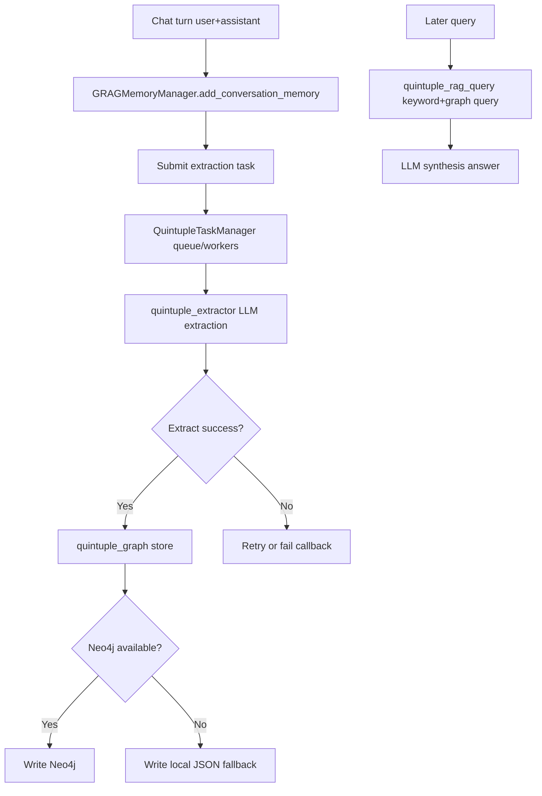

# NagaAgent `summer_memory` (Rearranged by PWSF)

This file is rearranged using one fixed architecture-writing pattern:

- `P`: Problem (what breaks or blocks)
- `W`: Why (root cause)
- `S`: Solve (design and implementation)
- `F`: Function (what capability the solution delivers)

This pattern matches your question format directly:
`why this problem happens -> how to solve -> what function the solution works`.

## 1) What This Subsystem Is For

`summer_memory` is the GRAG (graph-augmented memory) subsystem. It extracts structured knowledge from conversation and makes it queryable later.

Core function goals:

1. Persist long-term conversational knowledge as quintuples.
2. Avoid blocking chat response while extracting memory.
3. Retrieve useful historical facts during later conversations.
4. Keep working even when Neo4j is unavailable (fallback path).

## 2) Main Components

1. Orchestrator: `summer_memory/memory_manager.py`
`GRAGMemoryManager` handles conversation ingestion, task submission, callback handling, and graph writes.

2. Task pipeline: `summer_memory/task_manager.py`
`QuintupleTaskManager` handles queue, worker pool, dedupe, retry, timeout, and cleanup.

3. Extractor: `summer_memory/quintuple_extractor.py`
Calls LLM to extract quintuples from text/context.

4. Storage: `summer_memory/quintuple_graph.py`
Reads/writes graph memory with Neo4j-first strategy and local fallback.

5. Retrieval: `summer_memory/quintuple_rag_query.py`
Generates retrieval keywords and synthesizes answer from graph results.

## 3) End-to-End Workflow

## 4) PWSF Breakdown

### A. Non-blocking Memory Extraction

`P`:
Memory extraction can be slow (LLM + graph I/O). If done inline, chat latency increases.

`W`:
Extraction and storage are network or model-bound operations with variable runtime.

`S`:
Use async task pipeline: queue + worker pool + callback, decoupled from chat response path.

- enqueue in `GRAGMemoryManager.add_conversation_memory`
- execute in `QuintupleTaskManager` workers
- callback to `_on_task_completed` for storage

`F`:
Chat can return immediately while memory ingestion runs in background.

### B. Duplicate/Overload Risk in Task Pipeline

`P`:
Repeated same text and burst traffic can create duplicate tasks and queue overload.

`W`:
Conversation events are frequent and may contain repeated text segments.

`S`:
Task manager applies:

1. text-hash dedupe
2. max queue size limit
3. max workers bound
4. timeout + retry policy
5. periodic cleanup of old task metadata

`F`:
Memory pipeline remains bounded and predictable under load.

### C. Storage Availability and Reliability

`P`:
Neo4j may be unavailable or misconfigured; memory write path can fail.

`W`:
External graph backend is optional infrastructure, not always guaranteed online.

`S`:
Storage layer uses Neo4j-first with local-file fallback behavior in `quintuple_graph.py`.

`F`:
Memory persistence degrades gracefully instead of hard-failing the subsystem.

### D. Retrieval Quality from Raw Conversation

`P`:
Raw text retrieval is noisy; hard to map directly to useful historical facts.

`W`:
Conversation text is unstructured and semantically mixed.

`S`:
Use structured quintuples + LLM keyword extraction + graph query + answer synthesis.

`F`:
Higher precision recall of historical knowledge for follow-up questions.

### E. Operability and Debuggability

`P`:
Without visibility, extraction quality and graph correctness are hard to inspect.

`W`:
Asynchronous pipelines hide failures and data quality drift.

`S`:
Provide scripts for visualization and inspection:

1. `quintuple_visualize.py`
2. `quintuple_visualize_v2.py`
3. `visualize.py`
4. local JSON inspection files

`F`:
Developers can inspect graph output and debug extraction quality quickly.

## 5) Why This Pattern Is Recommended

For architecture notes in this repo, use this fixed writing order:

1. Function goal (what the subsystem is for)
2. PWSF per hard problem
3. Workflow diagram
4. Implementation map (module paths)
5. Runtime boundaries and fallback

Why this helps:

1. You can explain design choices in Java microservice terms quickly.
2. You avoid "just implementation details" without decision rationale.
3. You can convert each `S/F` into test cases and acceptance checks.

## 6) Optional Next Refactor (if you want)

If you want this doc to be more architecture-governance friendly, next step is adding one short table:

- `Problem | Root cause | Decision | Tradeoff | Acceptance check`

That turns this into a lightweight ADR-style note while staying readable.
