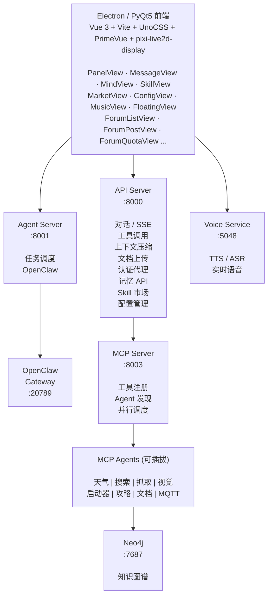
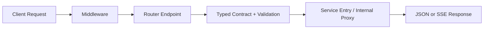

# NagaAgent Architecture Notes




## Part Index
0. Reading Guide
1. Startup and Runtime Orchestration
2. API Layer
3. Core Service Layer
4. LLM Gateway Layer
5. Memory and Knowledge Graph Layer
6. MCP and Tool Integration Layer
7. Frontend and UI Layer
8. Infra and Engineering Layer
9. Game-Theory (Self-Game) Layer

## 0. Reading Guide

### 0.1 文档用途
- 这份主文档是总纲，目标是快速回答每层的职责、输入输出、衔接关系与边界。
- 不承载过细实现细节，避免随着代码演进频繁失真。

### 0.2 主文档与子文档边界
- 主文档: 层级职责和跨层关系。
- 子文档: 问题分析、方案细节、工作流时序、代码映射。

### 0.3 模块深挖索引
- Part 1 启动与运行编排深挖: `./p1_startup_runtime.md`
- P2 API 深挖: `./p2_api.md`
- Part 3 运行层深挖: `./chat_runtime.md`
- Part 6 MCP/Tool 深挖: `./p6_mcp_tool.md`
- Part 7 前端与实时通道深挖: `./p7_frontend_ui.md`
- Part 8 基础设施与诊断深挖: `./p8_infra_engineering.md`

### 0.4 用户视角工作流
- 从用户视角看，`agentic_tool_loop` 不应理解成“代码里一堆函数怎么调用”，而应理解成一次多轮 Agent 编排：
> 用户发一句话后，系统会在背后持续判断：
> 是否需要工具 -> 调哪个工具 -> 工具结果怎么放回上下文 -> 是否继续追问模型 -> 什么时候停止并给用户最终回答。
- 它不是简单的一问一答，而是围绕 `messages + tools` 持续推进的运行时循环。
- 这条工作流横跨：
  1. Part 2 API Layer：接住请求、做输入装配。
  2. Part 3 Core Service Layer：执行 `run_agentic_loop(...)`。
  3. Part 4 LLM Gateway Layer：把 `messages + tools` 传给模型。
  4. Part 6 MCP and Tool Integration Layer：执行工具并返回结果。

#### 0.4.1 用户看到的表层流程
```text
用户输入问题
  -> 前端显示“正在生成”
  -> 后端开始流式返回内容
  -> 如果需要工具，系统内部调用工具
  -> 模型读取工具结果后继续生成
  -> 前端持续展示回答
  -> 最终回答完成
```

- 用户通常只看到“AI 在持续流式回答”。
- 但系统内部实际可能已经经历：
```text
解析用户意图
  -> 判断是否需要工具
  -> 调用对应工具
  -> 拿到工具结果
  -> 把工具结果回注到上下文
  -> 让模型基于工具结果继续生成
  -> 输出最终回答
```

#### 0.4.2 route 层在 loop 之前做什么
- 这一阶段更准确的名字是：输入装配 / context assembly。
- 它的目标不是把所有信息都塞给模型，而是把这次对话真正需要的输入整理好，再交给 `run_agentic_loop(...)` 去多轮推进。
- 如果从更高一层看，这里已经进入 `context engineering` 的范围。
- 在当前项目里，`context engineering` 不是某一个单独函数，而是一条贯穿 route 和 loop 的横切能力：
  1. 进入 loop 前：决定“这次该让模型看到什么”。
  2. loop 进行中：决定“哪些新信息要回注，哪些旧信息要压缩”。
  3. summary / degrade 时：决定“保留什么上下文，禁止什么能力”。
- route 层结束后，最关键的两类 LLM 输入是：
  1. `messages`：当前这一轮完整上下文。
  2. `tools`：当前模型允许调用的函数 schema。

- 但 route 层产生的信息并不只有这两类，更准确地说可以分成三类：

  A. 会进入 `messages` 的内容
  这些是 LLM 需要“读”的上下文，例如：
  ```text
  用户 message
  历史对话
  system prompt
  agent 设定
  业务规则
  工具使用说明
  RAG / context 检索结果
  skills prompt / supplement
  ```

  常见 shape 类似：
  ```python
  messages = [
      {"role": "system", "content": "...系统设定 / agent 规则 / 工具说明..."},
      {"role": "user", "content": "...用户问题..."},
  ]
  ```

  B. 不进 `messages`，但会作为 `tools` 单独传给 LLM 的内容
  这些描述的是“当前允许模型调用什么”，例如：
  ```text
  当前模型允许调用哪些工具
  每个工具叫什么
  参数 schema 是什么
  这个工具需要哪些字段
  ```

  它们通常不会拼进普通文本，而是并列传给模型：
  ```python
  llm.chat(
      messages=messages,
      tools=tools,
  )
  ```

  更准确地说：
  ```text
  messages = 让 LLM 读懂当前任务、背景、规则、历史
  tools = 告诉 LLM 当前可以调用哪些函数，以及参数格式是什么
  ```

  C. 不一定给 LLM 读，只是运行时自己用的东西
  这些更多是后端管理信息，例如：
  ```text
  session_id
  active flag
  stream id
  telemetry
  finalize 状态
  ```

  它们用于管理会话、流式响应、持久化和日志，但不一定进入 LLM 输入。
  这里的 `telemetry` 需要再区分一层：
  1. 作为 HTTP 路由暴露的 `/telemetry/*` 入口，归 Part 2 API Layer。
  2. 作为埋点、排队、flush、上传与诊断能力本体，归 Part 8 Infra / Engineering。
  3. 所以它会在 route 代码里出现，但架构主归属仍然是 Part 8。

- 所以这里要避免一个误解：不是 route 层产生的所有信息都要塞进 LLM；只有真正影响模型理解、判断、调用工具、生成回答的信息，才应该进入 `messages` 或 `tools`。

#### 0.4.3 从用户一句话开始的主链路
```text
用户发消息
  -> route 层完成输入装配
  -> 得到 messages + tools
  -> 进入 agentic_tool_loop
  -> 每轮调用 LLM
  -> LLM 判断是否需要工具
  -> 如果不需要工具：
      直接输出最终回答，stop
  -> 如果需要工具：
      解析 tool call
      标准化 tool call
      dispatcher 调用工具
      标准化 tool result
      tool result 回注 messages
      queue 信息合并进 messages
      compression 治理 messages
      进入下一轮
  -> 如果连续失败或达到 max_rounds：
      进入 summary round
      tools=None
      强制总结
  -> 最终 round_end(has_more=False)
  -> [DONE] 由底层流式链路产出并经 route 层转发
  -> 用户看到完整回答
```

- 如果把 `context engineering` 也叠加到这条主链路里，可以理解成：
```text
用户发消息
  -> route 层做 context engineering：
     - 选历史
     - 补 system / agent / RAG / supplement
     - 生成或关闭 tools schema
  -> 进入 agentic_tool_loop
  -> LLM 判断是否需要工具
  -> 如果有 tool call：
     - 执行工具
     - 回注 tool result
     - 合并 queue
     - 必要时 compression
     - 更新 messages
  -> LLM 基于更新后的上下文再判断
  -> 必要时进入 summary：
     - 补 summary 指令
     - tools=None
  -> 最终输出
```

- 这里的核心不是“模型调用了一次”，而是“系统维护了一轮又一轮的 `messages + tools` 状态”。
- 因此，这层更接近一个状态机：
  1. `round_start`
  2. `tool_call_parse / normalize`
  3. `tool_dispatch`
  4. `tool_result_injected`
  5. `next_round` 或 `stop`
  6. 必要时进入 `summary_round`

#### 0.4.4 route 和 loop 如何衔接
```text
routes/chat.py：
  负责装配初始输入
  得到 messages + tools

run_agentic_loop(...)：
  负责多轮推进
  每轮让 LLM 读取 messages + tools
  如果有 tool call，就执行工具并把结果回注 messages
  然后下一轮 LLM 再读更新后的 messages
```

- 可以把这层衔接概括成：
```text
route 层先把“这次 LLM 需要知道什么”和“这次 LLM 能调用什么”装配好。
其中：
- 需要知道什么 -> messages
- 能调用什么 -> tools
- 运行时管理信息 -> 后端自己保存，不一定给 LLM

然后 agentic_tool_loop 每一轮都让 LLM 基于 messages + tools 判断：
- 直接回答？
- 调用工具？
- 继续下一轮？
- 进入 summary？
- 停止？
```

- 如果再压缩成一句骨架：
```text
Agent loop：
  初始输入
    -> route 层装配上下文
    -> LLM 判断
    -> 如果需要工具：执行工具 -> 更新上下文 -> LLM 再判断
    -> 如果不需要工具：直接进入最终输出
    -> 反复迭代直到收敛
    -> 最终输出
```

- 更精确一点说：
  1. 初始“输入 / 组装上下文”主要发生在 route 层进入 loop 之前。
  2. 进入 loop 后，核心就是“LLM 判断 -> 工具执行 -> 更新上下文 -> 再判断”的多轮推进。
  3. 这里的“更新上下文”主要指 tool result 回注、queue 合并、compression 改写，以及必要时补入 summary 指令。
  4. `context engineering` 不是只发生在最开始那一次装配，而是每一轮都在参与决定“模型下一轮到底看到什么”。

#### 0.4.5 为什么工具调用成功后还要下一轮
- 工具调用成功后，系统通常不会直接把原始工具结果丢给用户。
- 更常见的流程是：
```text
tool result
  -> 注入 messages
  -> 下一轮 LLM 读取工具结果
  -> 生成面向用户的自然语言回答
```
- 所以 `tool_result_injected` 的关键意义不是“工具执行完了”，而是“工具结果已经变成下一轮模型可消费的上下文”。

#### 0.4.6 native tools 支持判断是什么意思
- 这一层可以理解成：当前模型能不能直接使用 function calling / tool calling 这种原生工具调用能力。
- 它解决的不是“工具要不要执行”，而是“模型如何把工具调用意图返回给后端”。
- 如果支持 native function calling：
  ```python
  llm.chat(messages=messages, tools=tools)
  ```
  模型可能直接返回结构化 tool call。
- 如果不支持 native function calling：
  ```python
  llm.chat(messages=messages, tools=None)
  ```
  系统通常会把工具调用说明写进 prompt，让模型输出文本格式 tool call，然后再由后端解析：
  ```python
  parse_tool_calls_from_text(...)
  ```

- 因此当前项目实际上存在两条路径：
```text
native function calling 路径：
  tools schema 直接传给模型
  模型返回结构化 tool call

text parsing 路径：
  工具说明写进 messages / prompt
  模型用文本格式输出 tool call
  后端再解析文本
```

- 两条路径的差异，也可以更直白地理解成：
  不支持 native：
  ```text
  你要在 prompt 里告诉模型：
  “如果要调用工具，请按这个 JSON 模板输出”
    -> 模型按文本输出 tool_call
    -> 后端从普通文本里提取 tool_call
    -> 解析 JSON
    -> 校验字段
    -> 标准化为 dispatch contract
  ```

  支持 native：
  ```text
  后端直接把 tools schema 作为结构化参数传给模型
    -> 模型如果要调用工具，会返回结构化 tool_calls 字段
    -> 后端读取 tool_calls
    -> 转换为内部 dispatch contract
  ```

- 所以可以把 native function calling 的工程价值概括成：
> native function calling 把“让模型按模板写 tool_call + 后端从文本里抠 tool_call”这部分，变成了模型 API 原生支持的结构化交互。

- 但它并不会替后端完成真正的工具执行链路。即使支持 native function calling，后端仍然需要负责：
  1. 定义 `tools schema`
  2. 判断当前模型是否支持 native tools
  3. 把 `tools` 传给 LLM
  4. 读取模型返回的 `tool_calls`
  5. 把 native `tool_calls` 转成内部统一 dispatch 格式
  6. 校验 `tool_name / args / 权限`
  7. 调 dispatcher / executor / MCP
  8. 标准化 `tool_result`
  9. 把 `tool_result` 回注 `messages`
  10. 控制 `max_rounds / summary / failure` 收敛

- 也就是说，native function calling 主要减少的是：
  ```text
  prompt 模板约束成本
  文本格式漂移风险
  JSON 提取风险
  tool fence 解析风险
  模型没按模板输出的风险
  ```
- 但它不会省掉：
  ```text
  tools schema 设计
  tool call 标准化
  工具执行
  结果回注
  错误处理
  多轮收敛
  ```
- 一句话总结：
> native function calling 不是替你执行工具，而是替你把“工具调用意图”以更稳定的结构化方式返回；真正的执行权、校验权、回注权和收敛控制权仍然在后端。

#### 0.4.7 工具失败时为什么不会卡死
- 用户视角里，工具失败不应表现为系统无限重试或直接炸掉。
- 当前项目期望的收敛逻辑是：
  1. 单次 tool error：只增加 failure count，不直接打断整个 loop。
  2. 连续失败达到阈值：进入 `summary_round`。
  3. 达到 `max_rounds` 且仍有 tool call：也进入 `summary_round`。
- 这层的核心目标不是“保证工具一定成功”，而是“保证异常情况下仍能收敛到可解释终态”。

#### 0.4.8 summary round 是什么
- `summary_round` 可以理解成：系统决定不再无限调用工具，而是强制模型基于已有上下文给出最终总结。
- 它的关键动作是：
```text
tools = None
```
- 这意味着：
  1. 这一轮不再允许模型继续调工具。
  2. 模型必须根据已有 `messages` 总结输出。

#### 0.4.9 queue 和 compression 在用户视角里的含义
- `queue`：
  1. 可以理解成对话过程中从侧路进来的补充消息。
  2. 它不会作为独立输入直接传给模型。
  3. 它会在工具轮结束后、下一轮 LLM 调用前 `drain()`，再合并进下一轮 `messages`。

- `compression`：
  1. 可以理解成“上下文太长时，对历史消息做压缩治理”。
  2. 它不是新增一个独立输入。
  3. 它会直接改写当前 `messages`，然后把压缩后的结果传给 LLM。

#### 0.4.10 一句话总结
- route 层的具体实现可以理解为一次输入编排：它把用户消息、历史上下文、system prompt、agent 设定、RAG/context、工具说明等组装成 LLM 可读取的 `messages`，同时根据模型能力生成或关闭 `tools` schema。后面的 `agentic_tool_loop` 每轮都会让 LLM 基于 `messages + tools` 判断是否直接回答、是否调用工具、是否继续下一轮或进入 summary。也就是说，LLM 不是只读一次，而是每一轮都读取被更新后的上下文；代码负责装配、回注、压缩、收敛和约束。

## 1. Startup and Runtime Orchestration

### 1.1 Function
- 把冷启动进程拉起为可对外服务的运行态。

### 1.2 Actions
- 解析启动参数、环境检查、端口冲突处理。
- 初始化 ServiceManager、后台事件循环和核心子系统（MCP/voice/memory）。
- 并行拉起 API/MCP/Agent/TTS 等服务。

### 1.3 Outputs
- 多服务可访问运行态。
- 启动日志与进度信号。
- 在非关键依赖故障时的降级可用能力。

### 1.4 Core Call Chain
- `main entry -> lazy init -> init subsystems -> start servers -> steady loop`

### 1.5 Deep-Dive Reference
- 启动与运行编排细节见 `./p1_startup_runtime.md`。

## 2. API Layer

### 2.1 Function
- 提供统一 HTTP 入口，把外部请求映射为内部能力调用。

### 2.2 Actions
- 构建 FastAPI app 与生命周期管理。
- 挂载 middleware、router、typed contract、proxy/compatibility endpoints。
- 统一错误与响应格式，向上游暴露稳定接口面。

### 2.3 Outputs
- 统一 API Surface（`/health`、`/chat`、`/chat/stream`、`/system/*`、`/mcp/*` 等）。
- 对内服务代理能力（例如与 agentserver 协同）。
- 对外兼容能力（例如 OpenAI-compatible path）。

### 2.4 Endpoint Domain Map
- Runtime/System: `/`, `/health`, `/health/full`, `/system/*`
- Chat/Agent: `/chat`, `/chat/stream`, `/agents/*`
- Session/Auth/Media: `/sessions*`, `/auth/*`, `/tts/speech`, `/asr/transcribe`
- Tooling/Extension: `/tool_*`, `/queue/*`, `/mcp/*`, `/skills/*`, `/openclaw/*`
- Compatibility/Telemetry: `/v1/chat/completions`, `/telemetry/*`

### 2.5 Why `/chat/stream` is a Thick Gateway
- 不是仅做协议转发，它在入口层就触发会话状态、流式生命周期、工具调度入口与持久化收尾。
- 结论: Part 2 负责“请求怎么进来”，Part 3 负责“进来之后怎么跑”。

### 2.6 Entry-Level Workflow (Short)


### 2.7 Deep-Dive Reference
- P2 的问题分析、方案、工作流与代码映射见 `./p2_api.md`。

## 3. Core Service Layer

### 3.1 Function
- 承载 assistant 运行时主链路: 会话、上下文、agentic loop、工具执行、持久化。

### 3.2 Actions
- 构建会话消息与上下文补充。
- 执行非流式与流式主链路。
- 执行多轮 tool loop、上下文压缩与工具结果回注。

### 3.3 Outputs
- 非流式 JSON 响应与流式 SSE 响应。
- 会话日志与持久化产物。
- 工具调用与结果注入后的可继续推理上下文。

### 3.4 Core Call Chains
- Non-stream: `/chat -> build messages -> LLM -> persist -> response`
- Stream: `/chat/stream -> run_agentic_loop -> tool dispatch -> persist -> stream close`

### 3.5 Deep-Dive Reference
- 运行层细节见 `./chat_runtime.md`。

## 4. LLM Gateway Layer

### 4.1 Function
- 统一模型接入层，屏蔽 provider 差异。

### 4.2 Actions
- 规范模型命名和参数注入。
- 提供 non-stream / stream / reasoning / tool-calling 通道。
- 在错误场景执行重试、认证刷新与降级信号输出。

### 4.3 Outputs
- 一致的模型调用契约。
- 结构化 SSE 事件输出（content/reasoning/tool calls）。

## 5. Memory and Knowledge Graph Layer

### 5.1 Function
- 把对话语义转为可检索记忆，并参与后续上下文构建。

### 5.2 Actions
- 结构化抽取（如 quintuple）与图谱/向量存储。
- 查询召回并向上游提供可注入记忆片段。

### 5.3 Outputs
- 可追踪的记忆资产与召回结果。
- 面向对话的 memory context 供 Part 3 使用。

## 6. MCP and Tool Integration Layer

### 6.1 Function
- 管理工具注册、发现、调用与结果规范化。

### 6.2 Actions
- MCP registry/manager 管理服务清单。
- 按工具类型路由到 MCP/OpenClaw/local adapters。

### 6.3 Outputs
- 统一工具能力视图与稳定工具调用结果结构。

### 6.4 Deep-Dive Reference
- MCP 与工具集成细节见 `./p6_mcp_tool.md`。

## 7. Frontend and UI Layer

### 7.1 Function
- 提供用户交互界面与流式内容消费能力。

### 7.2 Actions
- 调用 API/SSE，消费状态与内容事件。
- 驱动会话视图、工具状态、语音与多模态入口。

### 7.3 Outputs
- 用户可操作的交互体验与前端状态同步。

### 7.4 Deep-Dive Reference
- 前端实时通道与 websocket 细节见 `./p7_frontend_ui.md`。

## 8. Infra and Engineering Layer

### 8.1 Function
- 提供配置、构建、观测、发布与运行保障。

### 8.2 Actions
- 配置管理、日志/遥测、脚本化启动与发布打包。
- 质量门禁与测试体系维护。

### 8.3 Outputs
- 可运维、可发布、可观测的工程基座。

### 8.4 Deep-Dive Reference
- 内部健康诊断与工程运行细节见 `./p8_infra_engineering.md`。

## 9. Game-Theory (Self-Game) Layer

### 9.1 Function
- 通过自博弈/角色博弈方式改善策略质量与任务完成率。

### 9.2 Actions
- 角色设定、交互规则、评分与迭代反馈。
- 将有效策略沉淀回可复用的运行策略/提示约束。

### 9.3 Outputs
- 可复用策略资产与行为优化反馈回路。

## Appendix A. Ownership Matrix

### Context Engineer
- Part 2 中与上下文组装直接相关的入口语义定义。
- Part 3 运行层中的消息构建、压缩、工具结果回注策略。
- Part 4/5/9 中与模型行为质量、记忆质量、策略质量相关内容。

### Common Engineer
- Part 1/2 的平台入口、生命周期、路由/中间件、代理与可靠性。
- Part 6/7/8 的工具集成、前端集成、工程基础设施与可观测性。

## Appendix B. Triage Rule

- 若主要目标是提升上下文选择、压缩、召回、提示质量，归 Context Engineer。
- 若主要目标是提升稳定性、扩展性、观测性、部署集成，归 Common Engineer。

## Appendix C. Cross-Part Reference Map

- P2 (entry) -> P3 (runtime): 请求进入后由运行层执行主链路。
- P3 -> P4: 运行层通过 LLM gateway 发起模型调用。
- P3 -> P5: 运行层调用记忆系统补充上下文。
- P3 -> P6: 运行层通过 MCP/Tool 层执行外部动作。
