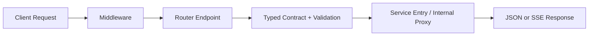

# NagaAgent Architecture Notes

## Part Index
0. Reading Guide
1. Startup and Runtime Orchestration
2. API Layer
3. Core Service Layer
4. LLM Gateway Layer
5. Memory and Knowledge Graph Layer
6. MCP and Tool Integration Layer
7. Frontend and UI Layer
8. Infra and Engineering Layer
9. Game-Theory (Self-Game) Layer

## 0. Reading Guide

### 0.1 文档用途
- 这份主文档是总纲，目标是快速回答每层的职责、输入输出、衔接关系与边界。
- 不承载过细实现细节，避免随着代码演进频繁失真。

### 0.2 主文档与子文档边界
- 主文档: 层级职责和跨层关系。
- 子文档: 问题分析、方案细节、工作流时序、代码映射。

### 0.3 模块深挖索引
- Part 1 启动与运行编排深挖: `./p1_startup_runtime.md`
- P2 API 深挖: `./p2_api.md`
- Part 3 运行层深挖: `./chat_runtime.md`
- Part 6 MCP/Tool 深挖: `./p6_mcp_tool.md`
- Part 7 前端与实时通道深挖: `./p7_frontend_ui.md`
- Part 8 基础设施与诊断深挖: `./p8_infra_engineering.md`

## 1. Startup and Runtime Orchestration

### 1.1 Function
- 把冷启动进程拉起为可对外服务的运行态。

### 1.2 Actions
- 解析启动参数、环境检查、端口冲突处理。
- 初始化 ServiceManager、后台事件循环和核心子系统（MCP/voice/memory）。
- 并行拉起 API/MCP/Agent/TTS 等服务。

### 1.3 Outputs
- 多服务可访问运行态。
- 启动日志与进度信号。
- 在非关键依赖故障时的降级可用能力。

### 1.4 Core Call Chain
- `main entry -> lazy init -> init subsystems -> start servers -> steady loop`

### 1.5 Deep-Dive Reference
- 启动与运行编排细节见 `./p1_startup_runtime.md`。

## 2. API Layer

### 2.1 Function
- 提供统一 HTTP 入口，把外部请求映射为内部能力调用。

### 2.2 Actions
- 构建 FastAPI app 与生命周期管理。
- 挂载 middleware、router、typed contract、proxy/compatibility endpoints。
- 统一错误与响应格式，向上游暴露稳定接口面。

### 2.3 Outputs
- 统一 API Surface（`/health`、`/chat`、`/chat/stream`、`/system/*`、`/mcp/*` 等）。
- 对内服务代理能力（例如与 agentserver 协同）。
- 对外兼容能力（例如 OpenAI-compatible path）。

### 2.4 Endpoint Domain Map
- Runtime/System: `/`, `/health`, `/health/full`, `/system/*`
- Chat/Agent: `/chat`, `/chat/stream`, `/agents/*`
- Session/Auth/Media: `/sessions*`, `/auth/*`, `/tts/speech`, `/asr/transcribe`
- Tooling/Extension: `/tool_*`, `/queue/*`, `/mcp/*`, `/skills/*`, `/openclaw/*`
- Compatibility/Telemetry: `/v1/chat/completions`, `/telemetry/*`

### 2.5 Why `/chat/stream` is a Thick Gateway
- 不是仅做协议转发，它在入口层就触发会话状态、流式生命周期、工具调度入口与持久化收尾。
- 结论: Part 2 负责“请求怎么进来”，Part 3 负责“进来之后怎么跑”。

### 2.6 Entry-Level Workflow (Short)

### 2.7 Deep-Dive Reference
- P2 的问题分析、方案、工作流与代码映射见 `./p2_api.md`。

## 3. Core Service Layer

### 3.1 Function
- 承载 assistant 运行时主链路: 会话、上下文、agentic loop、工具执行、持久化。

### 3.2 Actions
- 构建会话消息与上下文补充。
- 执行非流式与流式主链路。
- 执行多轮 tool loop、上下文压缩与工具结果回注。

### 3.3 Outputs
- 非流式 JSON 响应与流式 SSE 响应。
- 会话日志与持久化产物。
- 工具调用与结果注入后的可继续推理上下文。

### 3.4 Core Call Chains
- Non-stream: `/chat -> build messages -> LLM -> persist -> response`
- Stream: `/chat/stream -> run_agentic_loop -> tool dispatch -> persist -> stream close`

### 3.5 Deep-Dive Reference
- 运行层细节见 `./chat_runtime.md`。

## 4. LLM Gateway Layer

### 4.1 Function
- 统一模型接入层，屏蔽 provider 差异。

### 4.2 Actions
- 规范模型命名和参数注入。
- 提供 non-stream / stream / reasoning / tool-calling 通道。
- 在错误场景执行重试、认证刷新与降级信号输出。

### 4.3 Outputs
- 一致的模型调用契约。
- 结构化 SSE 事件输出（content/reasoning/tool calls）。

## 5. Memory and Knowledge Graph Layer

### 5.1 Function
- 把对话语义转为可检索记忆，并参与后续上下文构建。

### 5.2 Actions
- 结构化抽取（如 quintuple）与图谱/向量存储。
- 查询召回并向上游提供可注入记忆片段。

### 5.3 Outputs
- 可追踪的记忆资产与召回结果。
- 面向对话的 memory context 供 Part 3 使用。

## 6. MCP and Tool Integration Layer

### 6.1 Function
- 管理工具注册、发现、调用与结果规范化。

### 6.2 Actions
- MCP registry/manager 管理服务清单。
- 按工具类型路由到 MCP/OpenClaw/local adapters。

### 6.3 Outputs
- 统一工具能力视图与稳定工具调用结果结构。

### 6.4 Deep-Dive Reference
- MCP 与工具集成细节见 `./p6_mcp_tool.md`。

## 7. Frontend and UI Layer

### 7.1 Function
- 提供用户交互界面与流式内容消费能力。

### 7.2 Actions
- 调用 API/SSE，消费状态与内容事件。
- 驱动会话视图、工具状态、语音与多模态入口。

### 7.3 Outputs
- 用户可操作的交互体验与前端状态同步。

### 7.4 Deep-Dive Reference
- 前端实时通道与 websocket 细节见 `./p7_frontend_ui.md`。

## 8. Infra and Engineering Layer

### 8.1 Function
- 提供配置、构建、观测、发布与运行保障。

### 8.2 Actions
- 配置管理、日志/遥测、脚本化启动与发布打包。
- 质量门禁与测试体系维护。

### 8.3 Outputs
- 可运维、可发布、可观测的工程基座。

### 8.4 Deep-Dive Reference
- 内部健康诊断与工程运行细节见 `./p8_infra_engineering.md`。

## 9. Game-Theory (Self-Game) Layer

### 9.1 Function
- 通过自博弈/角色博弈方式改善策略质量与任务完成率。

### 9.2 Actions
- 角色设定、交互规则、评分与迭代反馈。
- 将有效策略沉淀回可复用的运行策略/提示约束。

### 9.3 Outputs
- 可复用策略资产与行为优化反馈回路。

## Appendix A. Ownership Matrix

### Context Engineer
- Part 2 中与上下文组装直接相关的入口语义定义。
- Part 3 运行层中的消息构建、压缩、工具结果回注策略。
- Part 4/5/9 中与模型行为质量、记忆质量、策略质量相关内容。

### Common Engineer
- Part 1/2 的平台入口、生命周期、路由/中间件、代理与可靠性。
- Part 6/7/8 的工具集成、前端集成、工程基础设施与可观测性。

## Appendix B. Triage Rule

- 若主要目标是提升上下文选择、压缩、召回、提示质量，归 Context Engineer。
- 若主要目标是提升稳定性、扩展性、观测性、部署集成，归 Common Engineer。

## Appendix C. Cross-Part Reference Map

- P2 (entry) -> P3 (runtime): 请求进入后由运行层执行主链路。
- P3 -> P4: 运行层通过 LLM gateway 发起模型调用。
- P3 -> P5: 运行层调用记忆系统补充上下文。
- P3 -> P6: 运行层通过 MCP/Tool 层执行外部动作。
