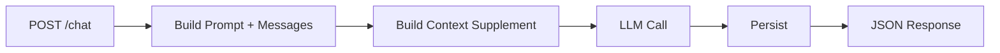
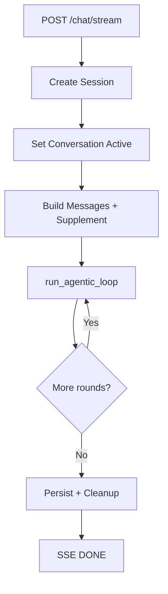
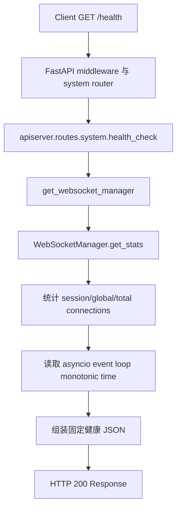
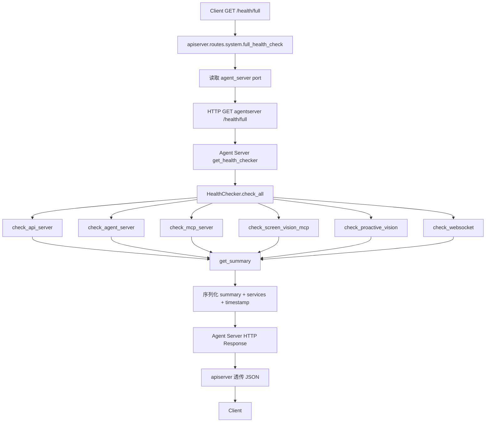

# P2 API Layer Deep Dive

## 1. 文档定位

### 1.1 为什么单独拆 P2
- P2 是统一入口层，但在 `chat/stream` 场景承担了超出传统 gateway 的职责。
- 若把问题分析和运行细节都放在主文档，会和 Part 3 运行层重叠。

### 1.2 与主文档 Part 2 的关系
- 主文档 Part 2 只保留职责、边界、短流程和对外接口面。
- 本文档承接问题分析、入口工作流和代码映射。

### 1.3 与 Part 3 的边界
- Part 2: 请求怎么进来（契约、路由、流式入口治理）。
- Part 3: 进来之后怎么跑（会话运行时、loop、工具执行、持久化）。

## 2. P2 的职责边界

### 2.1 统一 HTTP 入口
- 通过 `FastAPI app + middleware + routers` 提供统一入口。

### 2.2 对外契约与兼容层
- 提供 typed request/response contract。
- 提供 OpenAI-compatible path 和内部 proxy bridge。

### 2.3 为什么它是 thick gateway，而不是 thin gateway
- `/chat/stream` 在网关层就触发：
1. 会话生命周期状态。
2. 流式响应控制。
3. 运行层主链路入口调用与收尾。

## 3. 入口对象与关键路由

### 3.1 `app = FastAPI(...)`
- 位于 `apiserver/api_server.py`，带 lifespan 初始化与清理。

### 3.2 middleware
- 统一处理 CORS、token 同步等横切关注点。

### 3.3 router 注册
- forum/auth/session/system/tools/extensions/chat/openai_proxy/telemetry 按域注册。

### 3.4 endpoint domain map
- Runtime/System: `/`, `/health`, `/health/full`, `/system/*`
- Chat/Agent: `/chat`, `/chat/stream`, `/agents/*`
- Tool/Extension: `/mcp/*`, `/skills/*`, `/queue/*`, `/openclaw/*`
- Compatibility/Telemetry: `/v1/chat/completions`, `/telemetry/*`

## 4. `/chat` 与 `/chat/stream` 入口差异

### 4.1 `/chat`：非流式主链路入口
- 请求完成后一次性返回 JSON。
- 生命周期短，失败面相对窄。

### 4.2 `/chat/stream`：流式主链路入口
- 通过 SSE 长连接持续输出事件。
- 同时承接状态、通知、收尾一致性。

### 4.3 为什么 `/chat/stream` 更难
- Streaming + state consistency
- 多轮工具编排控制
- 入口编排可维护性

## 5. P2 的三类核心问题

### 5.1 Streaming + State Consistency
- SSE 断连/异常时，活动状态与结束事件必须一致。

### 5.2 Multi-Round Tool Loop Control
- 模型输出可能反复触发工具调用，必须有预算与停止条件。

### 5.3 Maintainable Orchestration
- 入口承载多能力拼接，若无边界会演化为难维护巨函数。

## 6. P2 的解决思路

### 6.1 生命周期与 cleanup 语义
- 显式 `started/ended` 生命周期事件。
- `finally` 兜底清理，确保断连也能收尾。

### 6.2 有边界的 loop 控制
- `max_rounds`、失败阈值、总结轮等硬边界。
- 固定状态转移：`LLM -> parse -> dispatch -> inject -> next/stop`。

### 6.3 Orchestrator + Adapter/Strategy 分层
- 入口路由负责 orchestration。
- 具体执行通过 adapter/strategy 层扩展。

### 6.4 Queue 路线与扩展方向
- 当前是进程内队列。
- 中长期可演进为会话级队列抽象，再到分布式后端。

## 7. 入口级工作流

### 7.1 `/chat` workflow


### 7.2 `/chat/stream` workflow


### 7.3 请求进入 Part 3 的边界点
- 当入口准备完成并调用 `run_agentic_loop`/LLM service 时，进入 Part 3 职责。

## 8. Code Mapping

### 8.1 `apiserver/api_server.py`
- app、middleware、router 挂载、typed contract、internal proxy。

### 8.2 `apiserver/routes/chat.py`
- `/chat`、`/chat/stream` 入口编排与流式生命周期处理。

### 8.3 `apiserver/routes/system.py`
- `/health`、`/health/full` 入口。
- `/health/full` 通过 internal HTTP 调用 `agentserver` 全量健康检查。

### 8.4 `apiserver/message_queue.py` 和 `apiserver/routes/tools.py`
- 入口关联队列与 websocket stats/broadcast 能力。

## 9. 与测试的关系

### 9.1 当前 smoke 为什么先卡 P2
- P2 是统一入口，最能覆盖“系统是否被改挂”的风险。

### 9.2 P2 对应测试层级
- `smoke/blocking`: `/health`、`/chat`、`/chat/stream`。
- `integration`: `/health/full` 与真实依赖联动。

### 9.3 后续 integration 应补什么
- 真实 agentserver 协同。
- 真实 tool loop 与 queue 交互。
- 真实 memory/RAG 参与的入口稳定性验证。

## 10. 当前非目标

### 10.1 真实 tool loop 深层语义
- 由 Part 3 深挖和 integration 承接。

### 10.2 memory/RAG 质量
- 属于 Part 5 与更高层评估问题。

### 10.3 更深的 Part 3 运行细节
- 如 context compression 内部策略、失败补偿细节不在本文档展开。

## 11. `/health` 与 `/health/full` 的实际运行流程

`/health` 和 `/health/full` 都由 P2 暴露，但它们不是同一条诊断链的两个深度级别。

- `/health` 是 apiserver 进程内的快速响应，只读取本地内存状态，不访问其他服务。
- `/health/full` 是跨进程诊断入口，会转发到 Agent Server，再由
  `system.health_check.HealthChecker` 检查多个服务。

因此，阅读运行映射时必须先区分“当前步骤执行了什么动作”和“该动作触达的模块归属
哪个 Part”，不能把所有健康探测都理解成 `apiserver /health` 内部动作。

### 11.1 `GET /health`：apiserver 进程内快速检查

#### 11.1.1 调用链



#### 11.1.2 `apiserver /health` 内部的具体动作

`apiserver/routes/system.py::health_check` 当前只执行以下动作：

1. 获取进程内 `WebSocketManager` 单例。
2. 调用 `get_stats()` 读取当前内存中的 WebSocket 连接集合。
3. 从统计结果中取出 `total_connections`。
4. 读取当前 asyncio event loop 的 monotonic time。
5. 组装并返回 JSON：

```json
{
  "status": "healthy",
  "agent_ready": true,
  "websocket_connections": 0,
  "timestamp": "..."
}
```

各字段的实际语义是：

| 字段 | 产生动作 | 当前语义 |
|---|---|---|
| `status` | endpoint 固定写入 `"healthy"` | 该请求执行到返回阶段；不是综合服务健康结论 |
| `agent_ready` | endpoint 固定写入 `true` | 当前是兼容性/契约字段；没有执行 Agent 或 LLM readiness 探测 |
| `websocket_connections` | `WebSocketManager.get_stats()` 汇总内存集合 | 当前 apiserver 进程记录的连接数；没有建立新的 WebSocket 连接 |
| `timestamp` | `asyncio.get_running_loop().time()` | event loop 单调时钟值；不是业务时间或 ISO 时间 |

#### 11.1.3 `/health` 明确不会执行的动作

`GET /health` 不会：

1. 请求 Agent Server。
2. 调用真实 LLM。
3. 连接 Neo4j、memory 或 RAG。
4. 查询 MCP `/services` 或 `/status`。
5. 检查 OpenClaw。
6. 建立 WebSocket handshake 或发送广播。
7. 调用 `system.health_check.check_all()`。

所以 `/health` 的准确定位是“P2 HTTP 入口仍可处理请求，并附带一个本地 WebSocket
连接计数”，不是“整个 NagaAgent 已完全就绪”。

#### 11.1.4 `/health` 的 Part 映射

| 当前步骤 | 具体动作 | 归属 Part | 说明 |
|---|---|---|---|
| FastAPI 接收并路由请求 | middleware、router matching、endpoint 调用 | Part 2 | P2 对外 HTTP 契约 |
| `health_check()` 组装响应 | 固定状态字段和 timestamp | Part 2 | 快速入口健康响应 |
| `get_websocket_manager()` | 获取进程内连接管理器 | Part 7 | 只读取 UI/WebSocket 本地状态 |
| `get_stats()` | 汇总 session/global connection sets | Part 7 | 不做网络探测或真实通信 |

这里的 `Part 2 + Part 7` 表示 `/health` 在 P2 入口中读取了 Part 7 的本地状态，不表示
它执行了 Part 7 的完整健康检查。

### 11.2 `GET /health/full`：跨进程完整诊断入口

#### 11.2.1 端到端调用链



#### 11.2.2 apiserver `/health/full` 步骤内的动作

P2 在这一层只承担代理和错误转换：

1. 从配置读取 Agent Server 端口。
2. 创建 timeout 为 10 秒的 `httpx.AsyncClient`。
3. 请求 `http://127.0.0.1:{agent_port}/health/full`。
4. Agent Server 返回 HTTP 200 时，解析并原样返回其 JSON。
5. 无法连接 Agent Server 时，返回 HTTP 503。
6. 其他异常当前统一转换为 HTTP 500。

这里还没有执行 MCP、WebSocket 或 Agent 的具体检查。真正的检查发生在下一步
`agentserver /health/full`。

#### 11.2.3 Agent Server `/health/full` 步骤内的动作

Agent Server 执行：

1. 获取全局 `HealthChecker`。
2. 调用 `check_all()` 收集每个服务的 `HealthCheckResult`。
3. 调用 `get_summary(results)` 计算整体状态。
4. 将枚举和 dataclass 转成 JSON 可序列化字典。
5. 返回 `summary`、`services` 和 ISO timestamp。

`check_all()` 当前依次等待以下检查，并对每一项单独捕获异常。单项检查抛出未处理异常
时，该项会被记录为 `UNKNOWN`，不会直接中断其他检查结果的组装。

#### 11.2.4 `HealthChecker` 的具体检查动作

| 检查函数 | 实际动作 | 状态判定重点 | 归属 Part |
|---|---|---|---|
| `check_api_server()` | 等待 API 端口；请求 `/health`；请求 `/ws/stats` | 全通过为 healthy，部分通过为 degraded | Part 2 + Part 7 |
| `check_agent_server()` | 检查 Agent Server 端口；请求其 `/health` | 端口和 endpoint 是否可用 | Part 1 + Part 3 |
| `check_mcp_server()` | 检查 MCP 端口；请求 `/services`、`/status` | MCP server 和服务发现入口是否可用 | Part 6 |
| `check_screen_vision_mcp()` | 查询 `/services`；重试确认 `screen_vision` 注册；必要时探测 `/call` | 可选视觉工具是否注册/可访问 | Part 6 |
| `check_proactive_vision()` | 请求 Agent Server 的 config、status、metrics；解析 enabled/running | 主动感知配置和运行状态 | Part 1 + Part 3 |
| `check_websocket()` | 检查 API 端口；请求 `/ws/stats`；探测 `/ws/broadcast` endpoint | WebSocket HTTP 管理入口是否存在 | Part 7 |

`check_websocket()` 检查的是 WebSocket 相关 HTTP 管理端点，不会建立真实 WebSocket
连接。因此它能证明管理入口存在，但不能证明浏览器与服务端之间的双向通信完整可用。

#### 11.2.5 summary 的生成动作

`get_summary()` 会统计：

1. `healthy`
2. `degraded`
3. `unhealthy`
4. `unknown`
5. `total_services`
6. `overall_health_percent`

整体状态规则是：

```text
存在 unhealthy 或 unknown -> overall_status = unhealthy
否则存在 degraded         -> overall_status = degraded
否则                       -> overall_status = healthy
```

`overall_health_percent` 当前只按 `healthy / total_services` 计算。`degraded` 不计入健康
数量，因此它是健康项占比，不是带权可用性评分。

### 11.3 分层运行映射表

下面的表用于总结动作归属。每一行都是 `/health/full` 链路中的一个独立步骤，不应被
理解为 `apiserver /health` 一次请求会执行所有这些动作。

| 链路步骤 | 当前步骤执行的动作 | 下一跳/读取对象 | 归属 Part | 深挖文档 |
|---|---|---|---|---|
| `apiserver GET /health` | 读取本地 WebSocket 计数并组装固定健康 JSON | 进程内 `WebSocketManager` | Part 2 + Part 7 | `./p7_frontend_ui.md` |
| `apiserver GET /health/full` | 读取端口、创建 HTTP client、代理请求、转换连接错误 | `agentserver /health/full` | Part 2 + Part 1 | `./p1_startup_runtime.md` |
| `agentserver GET /health/full` | 调用 checker、聚合结果、序列化响应 | `HealthChecker` | Part 1 + Part 8 | `./p1_startup_runtime.md`, `./p8_infra_engineering.md` |
| `HealthChecker.check_all()` | 调度各服务检查并隔离单项异常 | 六类 checker methods | Part 8 | `./p8_infra_engineering.md` |
| MCP 检查 | 端口检查、服务列表和状态 endpoint 探测 | MCP server | Part 6 | `./p6_mcp_tool.md` |
| WebSocket 检查 | API 端口及 WS 管理 endpoint 探测 | apiserver `/ws/*` | Part 7 | `./p7_frontend_ui.md` |
| Agent/主动视觉检查 | Agent 端口、健康及主动视觉 endpoint 探测 | Agent Server | Part 1 + Part 3 | `./p1_startup_runtime.md`, `./chat_runtime.md` |
| `get_summary()` | 统计状态数量并计算 overall status/percent | `HealthCheckResult` 集合 | Part 8 | `./p8_infra_engineering.md` |

### 11.4 结论

- `/health` 是 P2 的本地快速入口契约，动作止于进程内状态读取和 JSON 组装。
- `/health/full` 才是 P2 到 Agent Server，再到 Part 6/7/8 等模块的完整诊断链。
- 运行映射表描述的是每个步骤的职责归属，不表示所有动作都发生在
  `apiserver /health` 内。
- P2 负责暴露入口、代理请求和稳定响应契约；各 Part 的真实健康判定仍由对应模块和
  `HealthChecker` 承担。
