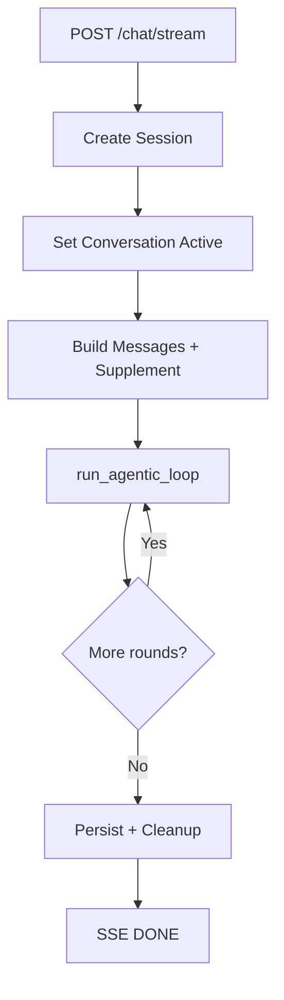
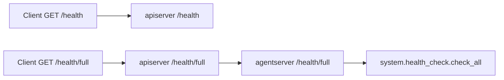

# P2 API Layer Deep Dive

## 1. 文档定位

### 1.1 为什么单独拆 P2
- P2 是统一入口层，但在 `chat/stream` 场景承担了超出传统 gateway 的职责。
- 若把问题分析和运行细节都放在主文档，会和 Part 3 运行层重叠。

### 1.2 与主文档 Part 2 的关系
- 主文档 Part 2 只保留职责、边界、短流程和对外接口面。
- 本文档承接问题分析、入口工作流和代码映射。

### 1.3 与 Part 3 的边界
- Part 2: 请求怎么进来（契约、路由、流式入口治理）。
- Part 3: 进来之后怎么跑（会话运行时、loop、工具执行、持久化）。

## 2. P2 的职责边界

### 2.1 统一 HTTP 入口
- 通过 `FastAPI app + middleware + routers` 提供统一入口。

### 2.2 对外契约与兼容层
- 提供 typed request/response contract。
- 提供 OpenAI-compatible path 和内部 proxy bridge。

### 2.3 为什么它是 thick gateway，而不是 thin gateway
- `/chat/stream` 在网关层就触发：
1. 会话生命周期状态。
2. 流式响应控制。
3. 运行层主链路入口调用与收尾。

## 3. 入口对象与关键路由

### 3.1 `app = FastAPI(...)`
- 位于 `apiserver/api_server.py`，带 lifespan 初始化与清理。

### 3.2 middleware
- 统一处理 CORS、token 同步等横切关注点。

### 3.3 router 注册
- forum/auth/session/system/tools/extensions/chat/openai_proxy/telemetry 按域注册。

### 3.4 endpoint domain map
- Runtime/System: `/`, `/health`, `/health/full`, `/system/*`
- Chat/Agent: `/chat`, `/chat/stream`, `/agents/*`
- Tool/Extension: `/mcp/*`, `/skills/*`, `/queue/*`, `/openclaw/*`
- Compatibility/Telemetry: `/v1/chat/completions`, `/telemetry/*`

## 4. `/chat` 与 `/chat/stream` 入口差异

### 4.1 `/chat`：非流式主链路入口
- 请求完成后一次性返回 JSON。
- 生命周期短，失败面相对窄。

### 4.2 `/chat/stream`：流式主链路入口
- 通过 SSE 长连接持续输出事件。
- 同时承接状态、通知、收尾一致性。

### 4.3 为什么 `/chat/stream` 更难
- Streaming + state consistency
- 多轮工具编排控制
- 入口编排可维护性

## 5. P2 的三类核心问题

### 5.1 Streaming + State Consistency
- SSE 断连/异常时，活动状态与结束事件必须一致。

### 5.2 Multi-Round Tool Loop Control
- 模型输出可能反复触发工具调用，必须有预算与停止条件。

### 5.3 Maintainable Orchestration
- 入口承载多能力拼接，若无边界会演化为难维护巨函数。

## 6. P2 的解决思路

### 6.1 生命周期与 cleanup 语义
- 显式 `started/ended` 生命周期事件。
- `finally` 兜底清理，确保断连也能收尾。

### 6.2 有边界的 loop 控制
- `max_rounds`、失败阈值、总结轮等硬边界。
- 固定状态转移：`LLM -> parse -> dispatch -> inject -> next/stop`。

### 6.3 Orchestrator + Adapter/Strategy 分层
- 入口路由负责 orchestration。
- 具体执行通过 adapter/strategy 层扩展。

### 6.4 Queue 路线与扩展方向
- 当前是进程内队列。
- 中长期可演进为会话级队列抽象，再到分布式后端。

## 7. 入口级工作流

### 7.1 `/chat` workflow

### 7.2 `/chat/stream` workflow

### 7.3 请求进入 Part 3 的边界点
- 当入口准备完成并调用 `run_agentic_loop`/LLM service 时，进入 Part 3 职责。

## 8. Code Mapping

### 8.1 `apiserver/api_server.py`
- app、middleware、router 挂载、typed contract、internal proxy。

### 8.2 `apiserver/routes/chat.py`
- `/chat`、`/chat/stream` 入口编排与流式生命周期处理。

### 8.3 `apiserver/routes/system.py`
- `/health`、`/health/full` 入口。
- `/health/full` 通过 internal HTTP 调用 `agentserver` 全量健康检查。

### 8.4 `apiserver/message_queue.py` 和 `apiserver/routes/tools.py`
- 入口关联队列与 websocket stats/broadcast 能力。

## 9. 与测试的关系

### 9.1 当前 smoke 为什么先卡 P2
- P2 是统一入口，最能覆盖“系统是否被改挂”的风险。

### 9.2 P2 对应测试层级
- `smoke/blocking`: `/health`、`/chat`、`/chat/stream`。
- `integration`: `/health/full` 与真实依赖联动。

### 9.3 后续 integration 应补什么
- 真实 agentserver 协同。
- 真实 tool loop 与 queue 交互。
- 真实 memory/RAG 参与的入口稳定性验证。

## 10. 当前非目标

### 10.1 真实 tool loop 深层语义
- 由 Part 3 深挖和 integration 承接。

### 10.2 memory/RAG 质量
- 属于 Part 5 与更高层评估问题。

### 10.3 更深的 Part 3 运行细节
- 如 context compression 内部策略、失败补偿细节不在本文档展开。

## 11. `/health` 与内部诊断的跨 Part 运行映射

### 11.1 调用链

### 11.2 运行映射表
| P2 入口行为 | 实际下游/模块 | 归属 Part | 深挖文档 |
|---|---|---|---|
| `GET /health` 快速可用性检查 | `apiserver/routes/system.py::health_check` + `apiserver/websocket_manager.py::get_stats` | Part 2 + Part 7 | `./p7_frontend_ui.md` |
| `GET /health/full` 网关转发 | `apiserver/routes/system.py::full_health_check` -> `agentserver /health/full` | Part 2 + Part 1 | `./p1_startup_runtime.md` |
| 全量健康摘要输出 | `system/health_check.py::check_all/get_summary` | Part 8 | `./p8_infra_engineering.md` |
| MCP 与服务发现健康探测 | `system/health_check.py::check_mcp_server/check_screen_vision_mcp` -> `mcp_server /services /status` | Part 6 | `./p6_mcp_tool.md` |
| WebSocket 可用性探测 | `system/health_check.py::check_websocket` -> `api /ws/stats /ws/broadcast` | Part 7 | `./p7_frontend_ui.md` |
| Agent 能力与主动感知探测 | `system/health_check.py::check_agent_server/check_proactive_vision` -> `agentserver /health /proactive_vision/*` | Part 1 + Part 3 | `./p1_startup_runtime.md`, `./chat_runtime.md` |

### 11.3 结论
- `/health` 属于 P2 的快速入口健康契约。
- `/health/full` 仍是 P2 入口，但其结果来自多 Part 的真实运行态。
- 因此 P2 文档应展示“入口到内部诊断”的映射，而非吞并非 P2 实现细节。
