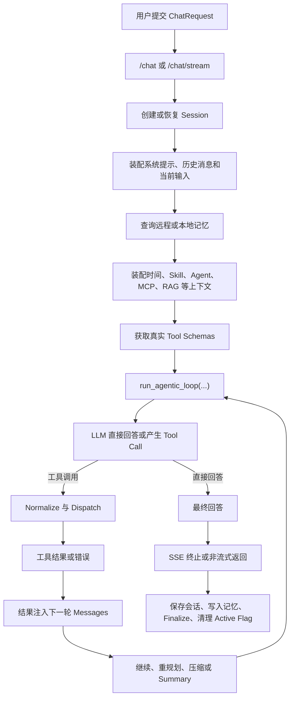

# Agent Workflow Golden Cases Testing

> **Migration status：`REVIEW_NEEDED / NOT_WIRED`。** Golden Case 资产尚未迁入 target branch，
> 旧执行结果不自动继承。详见 [`../MIGRATION_STATUS.md`](../MIGRATION_STATUS.md)。
>
> 对应 [`overview.md`](overview.md) 第 11 章。
>
> 历史分阶段实施范围与验收清单保存在 [`../plans/suspend/golden-cases-implementation.md`](../plans/suspend/golden-cases-implementation.md)；当前优先级见 [`../plans/sop-compiler-runtime-practical-roadmap.md`](../plans/sop-compiler-runtime-practical-roadmap.md)。

## 11.1 模块职责与范围

### 11.1.1 模块定位

`Agent Workflow Golden Cases` 是任务级质量回归模块。它位于以下测试层之上：

1. `p2_api`：验证 HTTP / SSE 入口、协议和 finalize 生命周期。
2. `agentic_tool_loop`：验证循环收敛、工具分发、结果注入和失败归因。
3. `quality_gate_summary`：聚合测试结果、比较 baseline 并输出门禁结论。

Golden Cases 不重复验证单个函数或单条协议，而是把用户任务作为测试输入，验证 Agent 是否沿正确业务路径完成任务。

它要回答的问题是：

1. Agent 是否理解了用户目标。
2. Agent 是否使用了正确的上下文、记忆或 Skill。
3. Agent 是否选择了正确的工具和参数。
4. 工具结果是否被后续推理真实消费。
5. 失败后是否会降级、重规划或保守结束。
6. 最终回答是否满足任务约束。
7. prompt、tool schema、context assembly 或 loop 变更后，任务质量是否相对 baseline 退化。

### 11.1.2 第一版覆盖范围

第一版只覆盖主对话 Agent 工作流：

```text
用户请求
  -> /chat 或 /chat/stream
  -> 会话、历史、记忆、Skill 和 Agent 上下文装配
  -> run_agentic_loop(...)
  -> LLM 决策
  -> 可选工具调用
  -> 工具结果回注
  -> 多轮收敛或 summary
  -> 最终回答
  -> 保存、记忆写入和流式收尾
```

第一版不要求覆盖 NagaAgent 的全部平台能力。Live2D、完整桌面自动化、真实 MCP 生态、多 Agent 协同和全量 RAG 评测应分别进入自己的 integration 或 staging 模块。

### 11.1.3 与普通 E2E 的区别

Golden Case 贯穿核心 Agent 业务闭环，但不等于所有依赖都使用真实服务。

- `stub profile` 保留真实 workflow 编排，以可控 LLM、工具和 memory 替代外部不确定依赖。
- `real_llm profile` 使用真实模型，但仍可 stub 工具，以验证模型决策没有明显退化。
- `staging profile` 才验证真实服务和真实工具链路。

因此，第一版 Golden Cases 仍以灰盒、确定性回归为主。

## 11.2 当前已落地范围

### 11.2.1 已有可复用基础

1. `tests/smoke` 已守住 `/health`、`/chat`、`/chat/stream`。
2. `tests/integration/chat_stream` 已覆盖真实 route 下的 SSE resilience 和 finalize。
3. `tests/unit/agentic_tool_loop` 已覆盖真实 `run_agentic_loop(...)` 的主要状态路径。
4. `tests/support/agentic_tool_loop_helpers.py` 已提供 scripted LLM、queue 和 SSE 辅助能力。
5. `tests/support/failure_attribution.py` 已提供任务失败归因字段。
6. `tests/support/quality_gate.py` 和 `tests/conftest.py` 已支持结果聚合、baseline compare 和报告输出。
7. `real_llm` marker 已提供非阻塞真实模型 smoke 的执行边界。

### 11.2.2 Golden Case 当前实现状态

本模块当前状态为：

```text
implemented v1 / partial P1 expansion
```

已经落地：

1. `tests/support/golden_cases.py`：Golden Case schema、loader、stub runner、run report 和 assertion checker。
2. `tests/golden_cases/cases/*.yaml`：当前 5 条 stub profile case。
3. `tests/golden_cases/test_agent_workflow_golden_cases.py`：按 case 文件参数化执行。
4. `tests/unit/test_golden_case_schema.py`：schema、loader、重复 ID、缺字段和仓库 case 枚举测试。
5. `tests/unit/test_golden_case_runner.py`：stub runner、工具顺序、timeout degrade 和 assertion failure 测试。
6. `pytest.ini`：已注册 `golden_case` marker。

当前验证结果：

```text
python -m pytest tests/golden_cases -m golden_case -q
5 passed, 2 warnings
```

仍未落地或只处于计划状态：

1. Golden Case 专属 `quality_gate_case` payload producer。
2. `tests/support/quality_gate.py::infer_feature(...)` 对 `tests/golden_cases` 或 `golden_case` marker 的 feature 映射。
3. `tests/golden_cases/baselines/stub.json` 等 Golden Case baseline 文件。
4. `real_llm` 和 staging profile 的 Golden Case 镜像 case。
5. CI workflow 中针对 Golden Cases 的阻塞或非阻塞执行入口。
6. BF-03 memory、BF-04 skill、BF-09 long-context compression 等 P1 扩展 case。

## 11.3 当前主流程定义

### 11.3.1 Case 设计流程

新增 case 时必须按以下顺序：

```text
识别真实业务风险
  -> 归属 11.9 中的业务流程
  -> 定义 workflow contract
  -> 定义 case schema
  -> 准备 fixtures 和故障注入
  -> 定义结构化 oracle
  -> 运行并记录 baseline
  -> 接入 quality gate
```

不能先从测试工具或 case 数量出发，再反向编造业务场景。

### 11.3.2 Case 执行流程

当前已落地的 stub profile 执行链路：

```text
pytest
  -> load_golden_cases(...)
  -> run_stub_golden_case(...)
  -> build messages from input.history + input.user_input
  -> patch scripted LLM / fake tool dispatcher / empty queue / no-op compression
  -> call real run_agentic_loop(...)
  -> collect GoldenCaseRunReport
  -> assert_golden_case_report(...)
```

计划接入 quality gate 后的完整链路：

```text
pytest
  -> execute Golden Case
  -> collect workflow facts
  -> emit quality_gate_case payload
  -> publish quality_gate_case
  -> compare current result with profile baseline
  -> output JSON / Markdown / terminal / Allure
```

当前 `tests/golden_cases` 尚未发出 `quality_gate_case` payload，也未被 `tests/support/quality_gate.py::infer_feature(...)` 纳入聚合范围。

### 11.3.3 Case Contract

每条 case 描述的是 workflow-level contract，而不是逐字输出。

```yaml
case_id: gc_tool_web_search_001
business_flow: BF-05
group: single_tool_success
profile: stub
title: 查询公开信息并基于工具结果总结

input:
  user_input: "查询 NagaAgent 最近发布的信息并总结"
  history: []
  session:
    temporary: true

fixtures:
  llm_script:
    - tool_call: tool__web_search
      args:
        query: "NagaAgent 最近发布"
    - final_answer: "..."
  tool_results:
    tool__web_search:
      status: success
      result: "固定搜索结果"

expected:
  final_status: success
  required_tools:
    - tool__web_search
  forbidden_tools: []
  max_rounds: 2
  required_answer_points:
    - "固定搜索结果中的关键事实"
  forbidden_answer_points:
    - "工具结果中不存在的发布日期"
  summary_triggered: false
  unhandled_exception: false

gate:
  blocking: true
  baseline_compare: true
```

### 11.3.4 断言原则

1. `stub` 可以精确断言工具名、参数、轮次、消息增量和终态。
2. `real_llm` 只做结构化或宽松语义断言，不做逐字输出比较。
3. 最终答案应验证关键事实和禁止项，不比较完整字符串。
4. 协议事实以 pytest outcome 和运行观测为准，payload 不覆盖真实测试结果。
5. 任务失败必须区分 `llm_stream`、`tool_dispatch`、`tool_result_injection`、`compression`、`finalize` 等阶段。

## 11.4 用例与断言

### 11.4.1 第一批 Golden Cases

第一批目标是 8 条确定性 case，覆盖主闭环中的高价值风险。当前已落地 5 条，剩余 3 条仍是 P1 扩展。

| case_id | 业务流程 | 状态 | 当前文件 | 任务目标 | 核心断言 |
|---|---|---|---|---|---|
| `gc_no_tool_answer_001` | BF-01 | LANDED | `tests/golden_cases/cases/gc_no_tool_answer_001.yaml` | 无需工具时直接回答 | 不调用工具、单轮收敛、无伪造来源 |
| `gc_history_continue_001` | BF-02 | LANDED | `tests/golden_cases/cases/gc_history_continue_001.yaml` | 依据历史约束继续回答 | 当前指令优先、正确使用历史条件 |
| `gc_memory_recall_001` | BF-03 | PLANNED | 未创建 | 召回用户偏好并用于回答 | 召回内容进入 context 且被最终回答消费 |
| `gc_skill_selected_001` | BF-04 | PLANNED | 未创建 | 指定 Skill 完成任务 | Skill 指令进入 supplement 且真实影响决策 |
| `gc_tool_web_search_001` | BF-05 | LANDED | `tests/golden_cases/cases/gc_tool_web_search_001.yaml` | 单工具查询并总结 | 工具名和参数正确、结果被下一轮消费 |
| `gc_tool_timeout_fallback_001` | BF-06 | LANDED | `tests/golden_cases/cases/gc_tool_timeout_fallback_001.yaml` | 工具超时后保守降级 | 不伪造结果、错误被消费、任务可收敛 |
| `gc_multi_tool_search_fetch_001` | BF-07 | LANDED | `tests/golden_cases/cases/gc_multi_tool_search_fetch_001.yaml` | 先搜索再抓取正文 | 调用顺序正确、第二步依赖第一步结果 |
| `gc_long_context_compression_001` | BF-09 | PLANNED | 未创建 | 压缩后保留关键约束 | 硬约束不丢失、轮次受控、最终回答正确 |

### 11.4.2 当前测试入口与证明边界

| 测试文件 | Layer | Profile | Gate | 状态 | 证明内容 | 不证明内容 |
|---|---|---|---|---|---|---|
| `tests/golden_cases/test_agent_workflow_golden_cases.py` | golden case | real loop + scripted LLM + fake tools | NOT_WIRED | LANDED | 5 条 YAML case 能通过真实 `run_agentic_loop(...)` 形成稳定任务级回归 | 不证明 FastAPI route、SSE finalize、持久化、真实 memory、真实 Skill、真实外部工具 |
| `tests/unit/test_golden_case_schema.py` | unit | schema / loader | NOT_WIRED | LANDED | schema 校验、文件发现、JSON/YAML 加载、重复 ID 和缺字段失败 | 不证明 Agent workflow 行为 |
| `tests/unit/test_golden_case_runner.py` | unit / component | real loop + deterministic doubles | NOT_WIRED | LANDED | runner、报告字段、工具顺序、timeout degrade、断言失败归因 | 不证明质量门禁聚合和 baseline compare |

### 11.4.3 第二批候选

| case_id | 分组 | 主要风险 |
|---|---|---|
| `gc_tool_failure_replan_001` | failure replan | 主工具失败后是否切换备用路径 |
| `gc_context_conflict_resolution_001` | context conflict | 当前指令与历史偏好冲突时是否采用最新意图 |
| `gc_queue_message_injection_001` | message injection | 执行中新增用户消息是否只注入一次并影响决策 |
| `gc_partial_result_synthesis_001` | partial result | 是否把不完整结果错误拼成确定事实 |
| `gc_max_rounds_summary_001` | convergence | 接近轮次上限时能否禁用工具并生成 summary |
| `gc_finalize_persistence_001` | finalize | 最终回答、保存和 active flag 清理是否一致 |

### 11.4.4 最小硬断言

每条 blocking stub case 至少应产出：

```text
case_id
business_flow
profile
final_status
failure_stage
rounds
tool_call_count
called_tools
summary_triggered
unhandled_exception
required_answer_points_passed
forbidden_answer_points_passed
```

当前 `GoldenCaseRunReport` 已包含：

```text
case_id
profile
final_status
failure_stage
rounds
tool_call_count
called_tools
tool_results
final_answer
summary_triggered
unhandled_exception
sse_events
llm_call_count
```

当前 `assert_golden_case_report(...)` 已断言：

1. `final_status`、`rounds`、`summary_triggered`、`unhandled_exception`。
2. required / forbidden tools。
3. required tools 的有序子序列。
4. required / forbidden answer points。

### 11.4.5 第一批门禁规则

| 指标 | 规则 |
|---|---|
| blocking stub cases | 必须 100% pass |
| blocking failure / safety cases | 必须 100% pass |
| required tool selection | blocking case 必须完全正确 |
| unsupported answer | blocking case 必须为 0 |
| unhandled exception | blocking case 必须为 0 |
| non-blocking real LLM pass rate | 不低于对应 baseline - 5% |
| context usage accuracy | 不低于对应 baseline - 5% |

`latency` 和平均轮次第一版只作为 warning / trend，不直接阻塞。

当前这些规则是 Golden Case 的目标门禁规则；在 `quality_gate_case` producer 和 baseline 文件落地前，`tests/golden_cases` 只作为本地可执行回归，不参与现有 `--quality-gate` 聚合。

## 11.5 测试执行链路

### 11.5.1 Stub Profile

用途：

1. 当前作为本地可执行的确定性 Agent workflow 回归。
2. 精确复现工具选择、失败、压缩和多轮决策。
3. 后续接入 quality gate 后，形成稳定、可归因的 case-level baseline。

当前已落地 stub profile 保留真实组件：

1. `run_agentic_loop(...)` 编排。
2. tool-call normalize。
3. tool result injection。
4. loop round events 和最终 answer 产出。

当前已替换或绕过组件：

1. FastAPI route：bypassed。
2. LLM：`ScriptedStreamLLM`。
3. 外部 tool executor：monkeypatched fake `execute_tool_calls(...)`。
4. tool result：来自 YAML `fixtures.tool_results`。
5. remote memory：bypassed。
6. queue 输入：`EmptyQueueStub`。
7. compressor：no-op passthrough。
8. save / finalize / persistence：bypassed。
9. quality gate 聚合：当前未接入。

因此，当前 stub profile 证明的是任务级 loop 决策和工具结果消费，不证明 route、finalize、持久化或真实外部依赖。

### 11.5.2 Real LLM Profile

用途：

1. 验证真实模型下工具选择和上下文使用没有明显退化。
2. 作为非阻塞可信度补充。

规则：

1. 通过环境变量显式启用。
2. 工具仍可使用固定 stub。
3. 使用关键点覆盖、工具选择和禁止项作为 oracle。
4. 不使用逐字答案和单次波动较大的分数阻塞 PR。

### 11.5.3 Staging Profile

用途：

1. 验证真实 LLM、真实 memory 和真实工具之间的链路可用性。
2. 发现 stub 无法暴露的认证、网络、schema 漂移和部署配置问题。

第一版只镜像少量高价值 case，不承担复杂质量评分，也不进入 blocking PR gate。

### 11.5.4 Baseline 文件

不同 profile 后续必须分别保存 baseline。当前 Golden Case baseline 文件尚未落地，下面是计划格式示例。

```json
{
  "baseline_version": "2026-06-12",
  "profile": "stub",
  "case_count": 8,
  "summary": {
    "pass_rate": 1.0,
    "tool_selection_acc": 1.0,
    "context_usage_acc": 1.0
  },
  "cases": {
    "gc_no_tool_answer_001": "pass",
    "gc_tool_web_search_001": "pass"
  }
}
```

baseline 更新必须显式确认，不能在每次运行后自动覆盖。

## 11.6 依赖替换与故障注入

### 11.6.1 依赖替换矩阵

| 依赖 | Stub Profile | Real LLM Profile | Staging Profile |
|---|---|---|---|
| FastAPI route | 当前 bypassed，后续可按 case 保留 | 按 case 保留 | 真实 |
| `run_agentic_loop(...)` | 真实 | 真实 | 真实 |
| LLM | scripted fake | 真实 | 真实 |
| tool schema | 由 case 构造的 stub schema | 真实 schema | 真实 |
| tool executor | stub | stub 或受控真实 | 真实 |
| memory | 当前 bypassed，后续 fake | fake 或受控真实 | 真实 |
| compressor | 当前 no-op passthrough，后续 deterministic | 受控或真实 | 真实 |
| queue / screen message | fake | fake | 真实或受控 |
| save / finalize | 当前 bypassed，后续 spy 或临时存储 | spy 或临时存储 | 真实 |
| quality gate | 当前 NOT_WIRED | NON_BLOCKING 或 OPT_IN | STAGING |

### 11.6.2 第一批故障注入

1. 工具 timeout。
2. 工具返回 error。
3. 工具返回空结果。
4. LLM 连续请求失败工具。
5. context compression 后丢失硬约束。
6. duplicate tool call。
7. queue 消息重复注入。
8. save / notify / telemetry side-channel 失败。

### 11.6.3 故障后的业务要求

故障注入不是只验证“抛了异常”，还必须验证：

1. 不产生 unsupported answer。
2. 不把失败结果表述为成功事实。
3. 能在受控轮次内收敛。
4. 有备用路径时可以重规划。
5. 无备用路径时明确说明信息不足。
6. `failure_stage` 与真实失败阶段一致。

## 11.7 当前边界与非目标

### 11.7.1 不与现有测试重复

1. 只验证 HTTP 状态码、SSE 终止事件：属于 `p2_api`。
2. 只验证 loop 某个内部分支：属于 `agentic_tool_loop` unit。
3. 只验证报告聚合算法：属于 `quality_gate_summary`。
4. 只验证真实外部服务连通：属于 staging smoke。

Golden Case 必须至少包含一个任务级业务契约。

### 11.7.2 第一版非目标

1. 不建设通用 LLM-as-a-Judge 平台。
2. 不建设 dataset experiment 平台。
3. 不把 Langfuse 作为 gate 真相源。
4. 不追求覆盖全部工具和全部 Agent。
5. 不用线上生产环境作为第一版前置条件。
6. 不以回答文采或逐字相似度作为主要质量标准。

### 11.7.3 当前已落地版本的边界

当前 5 条 Golden Cases 覆盖：

1. 无工具直接回答。
2. 历史上下文下的当前指令优先。
3. 单工具成功调用和结果消费。
4. 工具 timeout 后的 degraded / fallback 表达。
5. 多工具 search -> fetch 依赖链。

当前不覆盖：

1. FastAPI `/chat` 或 `/chat/stream` route。
2. SSE 终止事件、保存、notify、finalize 和 active flag 清理。
3. 真实 memory recall。
4. 真实 Skill / Agent context supplement。
5. 真实 context compression 质量。
6. 真实 LLM 决策波动。
7. MCP、网络、认证、部署配置和 staging 依赖。
8. `--quality-gate` 聚合、baseline compare 和报告发布。

这些缺口并不阻止当前版本作为 v1 发布；它们决定的是后续扩展优先级，而不是当前 stub profile 的有效性。

## 11.8 后续扩展

### 11.8.1 实施顺序

当前状态：

```text
Step 1: 统一 case schema、loader、runner、assertion checker 已落地
Step 2: 8 条目标 stub cases 中已落 5 条
Step 3+: baseline、quality_gate_case、real_llm、staging 仍未落地
```

推荐后续顺序：

```text
Step 1: 补齐 P1 stub cases：gc_memory_recall_001、gc_skill_selected_001、gc_long_context_compression_001
Step 2: 重新运行 python -m pytest tests/golden_cases -m golden_case -q，确认 8 条 case 全部通过
Step 3: 为 Golden Cases 增加 quality_gate_case payload producer
Step 4: 将 tests/golden_cases 或 golden_case marker 接入 tests/support/quality_gate.py::infer_feature(...)
Step 5: 产出第一版 tests/golden_cases/baselines/stub.json
Step 6: 在 CI 中增加 Golden Case workflow，先可非阻塞，再评估是否进入 PR gate
Step 7: 增加 1-2 条 real_llm 镜像 case
Step 8: 增加少量 staging 链路 case
Step 9: 将真实历史 badcase 固化为 known regression
```

### 11.8.2 推荐目录

```text
tests/
  golden_cases/
    cases/
      gc_no_tool_answer_001.yaml
      gc_history_continue_001.yaml
      gc_tool_web_search_001.yaml
      gc_tool_timeout_fallback_001.yaml
      gc_multi_tool_search_fetch_001.yaml
    baselines/
      stub.json
      real_llm.json
      staging.json
    test_agent_workflow_golden_cases.py
  support/
    golden_cases.py
```

当前实现使用扁平 `tests/golden_cases/cases/*.yaml` 目录；当 case 数量增加后，可以再按 `core_chat`、`context`、`tools`、`failure` 分组。无论目录是否分组，case 数据、runner、baseline 和报告职责应保持分离。

### 11.8.3 扩展原则

1. 只收录稳定、重要、可解释的任务。
2. 优先把真实线上或开发 badcase 固化为回归。
3. 每个 case 必须有明确业务归属和失败风险。
4. 先保证 stub profile 可复现，再升级为 real LLM 或 staging。
5. case 数量增长必须服从维护成本，不以数量作为完成度。

## 11.9 业务 / mapping 解析

### 11.9.1 总体业务链路

Golden Cases 贯穿的是主对话 Agent 的业务闭环：



Golden Case 不要求每个节点都使用真实外部依赖，但必须保留被测业务路径的真实控制流。

### 11.9.2 能力与代码入口映射

| 业务阶段 | 业务职责 | 主要代码入口 | Golden Case 观察点 |
|---|---|---|---|
| 请求入口 | 接收消息、session、agent、skill、图片等参数 | `apiserver/routes/chat.py` | 输入是否被正确传递 |
| 会话恢复 | 创建或恢复本轮 session | `apiserver/routes/chat.py` | history 和 session 边界 |
| 消息装配 | system、历史、当前 user message 排序 | `apiserver/message_manager.py` | 消息顺序和当前指令优先级 |
| 记忆召回 | 查询 remote/local memory | `apiserver/routes/chat.py`、memory services | 召回内容是否进入上下文 |
| 上下文补充 | 时间、Skill、Agent、MCP、RAG 等 | `system/config.py::build_context_supplement` | 选中能力是否真实影响决策 |
| 工具暴露 | 向模型提供当前工具 schema | `apiserver/tool_schemas.py` | 可用工具集合和名称 |
| Agent 循环 | 多轮 LLM、工具、压缩和停止条件 | `apiserver/agentic_tool_loop.py` | 轮次、收敛和失败阶段 |
| 工具执行 | normalize、dispatch、获取结果 | tool dispatcher / MCP bridge | 工具名、参数、顺序和结果 |
| 结果回注 | 将 tool result 放回消息 | `apiserver/agentic_tool_loop.py` | 下一轮是否消费结果 |
| 输出收尾 | SSE done、保存、记忆写入和清理 | `apiserver/routes/chat.py`、`message_manager.py` | 最终回答和生命周期一致性 |

### 11.9.3 BF-01 无工具直接回答

**用户场景**

用户问候、要求改写已给文本，或请求总结当前消息中已经存在的信息。

**业务路径**

```text
ChatRequest
  -> messages/context assembly
  -> run_agentic_loop
  -> LLM 直接输出
  -> finalize
```

**风险**

1. 无意义调用工具。
2. 单轮任务被扩张成多轮。
3. 为回答增加不存在的外部来源。

**对应 case**

`gc_no_tool_answer_001`：LANDED，见 `tests/golden_cases/cases/gc_no_tool_answer_001.yaml`。

### 11.9.4 BF-02 会话历史和当前指令延续

**用户场景**

用户在已有会话中继续追问，或当前指令覆盖之前的回答偏好。

**业务路径**

```text
session history
  -> build_conversation_messages
  -> current user message
  -> context supplement
  -> agent loop
```

**关键规则**

1. system、历史和当前输入的顺序必须稳定。
2. 当前明确指令优先于历史偏好。
3. 不应因为历史存在就调用无关工具。

**对应 case**

`gc_history_continue_001`：LANDED，见 `tests/golden_cases/cases/gc_history_continue_001.yaml`。

`gc_context_conflict_resolution_001`：PLANNED，第二批候选。

### 11.9.5 BF-03 记忆召回并参与回答

**用户场景**

用户要求 Agent 按过去记录的偏好、项目约束或个人信息继续处理任务。

**业务路径**

```text
current request
  -> remote/local memory query
  -> memory result
  -> context supplement
  -> agent decision
  -> final answer
```

**关键规则**

1. “召回成功”不等于任务成功。
2. 召回内容必须进入模型上下文。
3. 最终回答必须体现与当前任务相关的记忆。
4. 召回失败时不能伪造已有记忆。

**对应 case**

`gc_memory_recall_001`：PLANNED，当前尚未创建 case 文件。

### 11.9.6 BF-04 指定 Skill 或 Agent 上下文

**用户场景**

请求中带有 `skill` 或 `agent_id`，要求 Agent 按指定能力或角色执行。

**业务路径**

```text
ChatRequest.skill / agent_id
  -> load Skill / Agent config
  -> build_context_supplement
  -> agent loop
```

**关键规则**

1. 指定 Skill 的指令必须进入 supplement。
2. Agent 的 SOUL、notes、memory 等内容不能串到其他 Agent。
3. Skill 不存在时应明确降级，不能假装已加载。

**对应 case**

`gc_skill_selected_001`：PLANNED，当前尚未创建 case 文件。

### 11.9.7 BF-05 单工具成功

**用户场景**

用户请求实时搜索、网页抓取、天气查询或其他必须依赖工具的信息。

**当前真实能力示例**

1. `tool__web_search`：实时搜索。
2. `tool__web_fetch`：抓取目标网页正文。
3. `mcp__weather_time__today_weather`：查询天气。

**业务路径**

```text
LLM selects tool
  -> normalize name and args
  -> dispatch
  -> tool result
  -> inject into messages
  -> next LLM round
  -> final answer
```

**关键规则**

1. 工具名称必须来自实际 schema。
2. 参数必须满足用户语义。
3. 最终回答必须基于工具返回。
4. 不能只断言调用发生而忽略结果消费。

**对应 case**

`gc_tool_web_search_001`：LANDED，见 `tests/golden_cases/cases/gc_tool_web_search_001.yaml`。

### 11.9.8 BF-06 工具失败后的保守降级

**用户场景**

工具 timeout、返回 error、返回空结果或返回不可解析内容。

**业务路径**

```text
tool call
  -> failure result
  -> result injection
  -> LLM consumes failure
  -> retry / fallback / conservative answer
```

**关键规则**

1. 错误必须转成可消费的 tool result。
2. 不能把工具失败描述为查询成功。
3. 有备用工具时允许重规划。
4. 无可靠来源时应明确说明信息不足。
5. 连续失败必须在受控轮次内停止。

**对应 case**

`gc_tool_timeout_fallback_001`：LANDED，见 `tests/golden_cases/cases/gc_tool_timeout_fallback_001.yaml`。

`gc_tool_failure_replan_001`：PLANNED，第二批候选。

### 11.9.9 BF-07 多工具依赖链

**用户场景**

先搜索候选页面，再抓取其中一个页面正文，最后综合回答。

**业务路径**

```text
tool__web_search
  -> search result
  -> result injection
  -> LLM selects URL
  -> tool__web_fetch
  -> page content
  -> final synthesis
```

**关键规则**

1. 工具顺序正确。
2. 第二个工具参数应依赖第一个工具结果。
3. 最终回答区分不同来源和已确认事实。
4. 任一步失败后不能凭空补齐结果。

**对应 case**

`gc_multi_tool_search_fetch_001`：LANDED，见 `tests/golden_cases/cases/gc_multi_tool_search_fetch_001.yaml`。

### 11.9.10 BF-08 执行中消息注入

**用户场景**

Agent 执行多轮任务期间，用户追加约束或屏幕消息进入 queue。

**业务路径**

```text
round running
  -> queue receives message
  -> message injected once
  -> next LLM round
  -> plan changes
```

**关键规则**

1. 新消息只能注入一次。
2. 注入时机必须在后续决策前。
3. 新约束应真实改变计划或最终回答。

**对应 case**

`gc_queue_message_injection_001`：PLANNED，第二批候选。

当前 loop unit 已覆盖注入机制；Golden Case 只验证该机制是否产生正确业务影响。

### 11.9.11 BF-09 长上下文压缩后继续任务

**用户场景**

会话较长，系统触发 context compression，但用户的硬约束仍必须保留。

**业务路径**

```text
long messages
  -> compression
  -> compressed context
  -> next loop round
  -> tool or final answer
```

**关键规则**

1. Windows、项目目录、输出格式等硬约束不能丢失。
2. 压缩不能导致工具选择偏航。
3. summary round 前后的压缩不能制造死循环。
4. Golden Case 不重测 compressor 内部算法，只验证任务质量。

**对应 case**

`gc_long_context_compression_001`：PLANNED，当前尚未创建 case 文件。

### 11.9.12 BF-10 最终输出、持久化和收尾

**用户场景**

任务已经得到最终答案，需要完成 SSE 终止、保存会话、写入记忆和 active flag 清理。

**业务路径**

```text
final answer
  -> stream terminal event or JSON response
  -> save conversation/logs
  -> optional memory write
  -> finalize
  -> active flag cleanup
```

**关键规则**

1. 最终答案与保存内容一致。
2. temporary session 不执行不应发生的持久化。
3. notify、telemetry 等 side-channel 失败不能阻止主流程收尾。
4. 不能重复 finalize 或残留 active 状态。

**对应 case**

`gc_finalize_persistence_001`：PLANNED，第二批候选。

这条流程通常作为 route-level Golden Case 的共享出口契约。若 case 只验证 SSE 或 finalize 本身，应继续放在 `p2_api` integration，而不是重复进入 Golden Cases。

### 11.9.13 Case 归属判断

新增 case 前先完成以下判断：

1. 能映射到 BF-01 至 BF-10，并验证任务级结果：进入 Golden Cases。
2. 只验证内部状态转移：进入 unit。
3. 只验证 HTTP / SSE / finalize：进入 API integration。
4. 只验证真实依赖连通：进入 staging smoke。
5. 不能说明真实业务风险：暂不增加。

这能保证 Golden Cases 由业务风险驱动，而不是由当前代码结构、工具数量或测试框架驱动。
